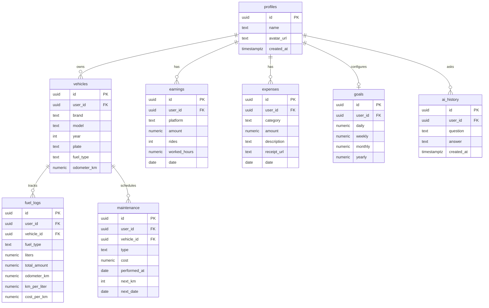

# Diagrama ER — Supabase (DriveFlow)

Relacionamentos principais do MVP v1.0. Todas as tabelas têm RLS por `auth.uid() = user_id` (ou equivalente via veículo).

## Storage buckets

| Bucket    | Uso                          |
|-----------|------------------------------|
| `avatars` | Foto de perfil               |
| `receipts`| Comprovantes de despesas     |

## Edge Functions

| Função    | Descrição                    |
|-----------|------------------------------|
| `ai-chat` | Assistente Groq com contexto |

## Cache local (Hive — Onda 9)

Boxes espelham leitura offline: `earnings`, `expenses`, `fuel_logs`, `maintenance`, `goals`, `pending_sync_queue`.

Write-through com fila de sync para ganhos e despesas.
