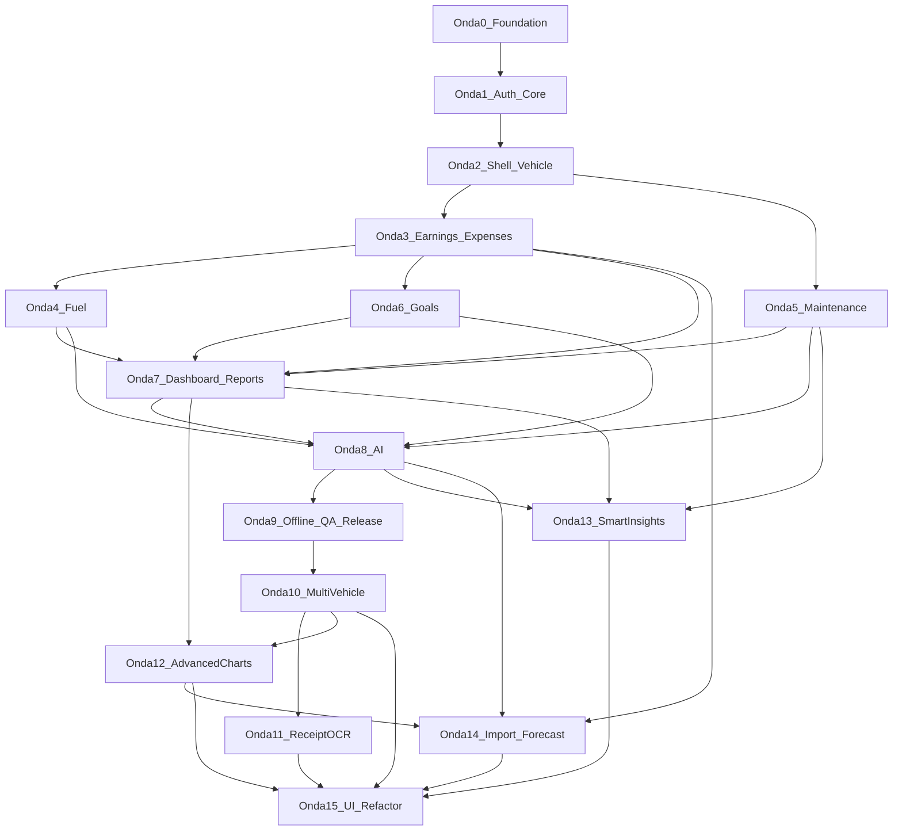
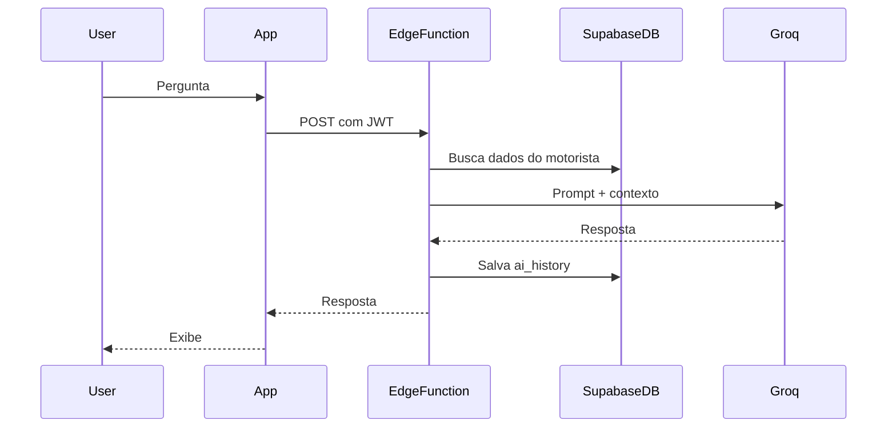

# DriveFlow — implementation-plan.md

Plano de implementação em **36 ondas** (0–36) para o DriveFlow (Flutter + Supabase + Groq), partindo de repositório vazio, combinando Clean Architecture feature-first do escopo com os padrões de organização do projeto MesclaInvest (screens/widgets/services separados, shell de navegação, mappers, test hooks).

**Fases:** ondas **0–9** = MVP v1.0 · ondas **10–14** = features pós-MVP · ondas **15–23** = Design System + Premium UI · ondas **24–29** = Integrações Uber/99/InDrive + inteligência cross-platform · ondas **30–33** = Analytics avançado por app + turno inteligente + caixa/metas + Pro analytics · onda **34** = Apple Premium UI (Geist + profundidade + hierarquia) · onda **35** = Taxista + onboarding editorial Mescla Invest · onda **36** = Cadastro em etapas (padrão Mescla Invest).

**Repositório:** `driveflow`  
**Referência:** `ES-PI3-2026-T2-G03` (MesclaInvest)

---

## Progresso das ondas

| Onda | Descrição | Status |
|------|-----------|--------|
| 0 | Scaffold Flutter + Supabase migrations/RLS + theme/router base | concluída |
| 1 | Authentication (email + Google) + auth gate + profiles sync | concluída |
| 2 | Main shell (5 abas) + vehicle CRUD + onboarding obrigatório | concluída |
| 3 | Earnings + Expenses CRUD com upload de comprovantes | concluída |
| 4 | Fuel logs com cálculos km/L, custo/km e sync com expenses | concluída |
| 5 | Maintenance CRUD + lembretes locais (RF12) | concluída |
| 6 | Goals (diária/semanal/mensal/anual) + progresso visual | concluída |
| 7 | Dashboard agregado + Reports com export PDF/CSV | concluída |
| 8 | Edge Function Groq + AI chat UI + ai_history | concluída |
| 9 | Offline-first Hive sync + Analytics/Crashlytics + 70% coverage + release prep | concluída |
| 10 | Múltiplos veículos + seletor ativo + escopo por veículo | pendente |
| 11 | OCR de comprovantes + preenchimento automático de despesas | pendente |
| 12 | Gráficos avançados + comparação de períodos | concluída |
| 13 | Lembretes inteligentes + insights de melhor horário | concluída |
| 14 | Importação de extratos + previsão IA | concluída |
| 15 | Refatoração de UI / Design System v2 | concluída |
| 16 | UI Excellence — paleta azul-claro, tipografia premium, motion auth | concluída |
| 17 | Premium UI — FitCal/FitFolio tier (hero ring, mesh, editorial auth) | concluída |
| 18 | Product Storytelling — narrativa, métricas de valor, upsell Pro | em andamento |
| 24 | Integrações foundation — hub Uber/99/InDrive, conexões OAuth, proveniência | concluída |
| 25 | Histórico de corridas + rollup automático de ganhos diários | concluída |
| 26 | Adapters OAuth Uber/99/InDrive (Edge Functions + tokens seguros) | concluída |
| 27 | Inteligência cross-platform — shift advisor, take rate, gaps de sync | concluída |
| 28 | Sync em background + webhooks + notificações de repasse | concluída |
| 29 | Analytics por plataforma + IA com contexto de corridas | concluída |
| 30 | Gráficos por app — evolução temporal, lucro líquido, R$/km, donut dashboard | em andamento |
| 31 | Turno inteligente — heatmap 7×24, plano de turno, simulador de mix | em andamento |
| 32 | Caixa e metas — calendário de repasses, metas por app, take rate temporal | em andamento |
| 33 | Pro analytics — regiões, consistência, PDF visual, IA com séries temporais | em andamento |
| 34 | Apple Premium UI — Geist, profundidade Wallet/Cash App, anti–vibe-coding | concluída |
| 35 | Taxista + onboarding editorial Mescla Invest (app vs táxi, UX manual) | concluída |
| 36 | Cadastro em etapas — uma pergunta por tela, progresso Mescla Invest | concluída |
| 37 | Bottom nav liquid glass + transições de aba na primeira visita | concluída |
| 38 | Correções P0 — auditoria sênior (router, vehicleId, sync, OAuth secrets) | concluída |
| 39 | Correções P1 — CI, erros UX, autoDispose, nav, metas, testes | concluída |

---

## Princípios de arquitetura

### Estrutura alvo (`lib/`)

```
lib/
├── main.dart
├── app.dart                          # MaterialApp.router + ProviderScope
├── supabase_dev_setup.dart           # URLs locais / dart-define (espelha firebase_dev_setup.dart)
│
├── core/
│   ├── theme/                        # app_colors, app_theme, theme_mode (Riverpod)
│   ├── router/                       # go_router, guards, transitions
│   ├── constants/                    # k-prefix, enums compartilhados
│   ├── services/                     # connectivity, notifications, analytics
│   ├── utils/                        # formatters BRL, datas, validators
│   ├── errors/                       # Failure, AppException
│   └── network/                      # Dio client (Groq proxy interno se necessário)
│
├── features/
│   ├── authentication/
│   ├── dashboard/
│   ├── earnings/
│   ├── expenses/
│   ├── vehicle/
│   ├── maintenance/
│   ├── goals/
│   ├── reports/
│   ├── ai/
│   ├── import/
│   ├── integrations/                 # Uber, 99, InDrive — OAuth, trips, sync
│   └── profile/
│
└── shared/
    ├── widgets/                      # driveflow_* prefix (espelha mescla_*)
    ├── models/                       # tipos cross-feature
    └── providers/                    # supabaseClient, hive boxes
```

### Estrutura interna de cada feature (Clean Architecture)

Padrão MesclaInvest adaptado: **screens/widgets separados**, **schema + mapper explícitos**, **injeção para testes**.

```
features/<feature>/
├── presentation/
│   ├── screens/          # *_screen.dart
│   ├── widgets/          # componentes da feature + *_screen_widgets.dart se grande
│   └── providers/        # Riverpod (@riverpod)
├── domain/
│   ├── entities/         # Freezed, imutáveis
│   ├── repositories/     # interfaces abstratas
│   └── usecases/         # um caso de uso por ação
└── data/
    ├── datasources/      # remote (Supabase) + local (Hive)
    ├── models/           # DTOs com json_serializable
    ├── mappers/          # supabase_row_mapper.dart (espelha *_firestore_mapper.dart)
    ├── schema/           # column constants (espelha *_firestore_schema.dart)
    └── repositories/     # implementações
```

### Padrões herdados do MesclaInvest

| MesclaInvest | DriveFlow |
|---|---|
| `lib/<feature>/screens/` | `features/<feature>/presentation/screens/` |
| `lib/<feature>/services/` | `data/datasources/` + `data/repositories/` |
| `*_firestore_schema.dart` | `data/schema/<entity>_schema.dart` |
| `*_firestore_mapper.dart` | `data/mappers/<entity>_mapper.dart` |
| `mescla_main_shell.dart` | `shared/widgets/driveflow_main_shell.dart` |
| `*ForTesting` nos screens | Mesmo hook nos construtores |
| `test/` flat | `test/<feature>_<unit>_test.dart` |
| `firebase_dev_setup.dart` | `supabase_dev_setup.dart` |

### Stack confirmada (MVP)

- **Flutter** + Dart ^3.11
- **Riverpod** (codegen) + **Flutter Hooks**
- **GoRouter** (auth redirect + shell routes)
- **Supabase** (Auth, Postgres, RLS, Storage, Edge Functions)
- **Hive** (offline-first + fila de sync)
- **Freezed** + **json_serializable** + **build_runner**
- **Dio** (Edge Function proxy / uploads)
- **Groq API** via **Supabase Edge Function** (API key nunca no client)
- **Firebase Analytics** + **Crashlytics**
- **flutter_local_notifications** (lembretes de manutenção)

---

## Diagrama de dependências entre ondas



---

## Onda 0 — Fundação do projeto

**Objetivo:** Repositório compilável com arquitetura, tooling e backend Supabase versionado.

### Entregas Flutter

- `flutter create` com org/package `com.driveflow.app` (ou preferência do time)
- [pubspec.yaml](pubspec.yaml): todas as deps do escopo + `flutter_lints`, `build_runner`, `riverpod_generator`, `custom_lint`
- Pastas `core/`, `features/`, `shared/` conforme estrutura acima
- [analysis_options.yaml](analysis_options.yaml) strict
- [app.dart](lib/app.dart): `ProviderScope` + `MaterialApp.router`
- Theme base: `core/theme/app_colors.dart`, `app_theme.dart` (light/dark, alto contraste)
- Constantes: plataformas (Uber, 99…), categorias de despesa
- `core/errors/failure.dart`, `core/utils/currency_formatter.dart`, `date_utils.dart`

### Entregas Supabase (`supabase/`)

```
supabase/
├── config.toml
├── migrations/
│   └── 001_initial_schema.sql
└── functions/
    └── (vazio até Onda 8)
```

**Migration 001** — tabelas do escopo + índices + triggers `updated_at`:

- `profiles` (estende auth.users: name, photo, created_at)
- `vehicles`, `earnings`, `expenses`, `fuel_logs`, `maintenance`, `goals`, `ai_history`

**RLS:** policy `auth.uid() = user_id` (ou via join em `vehicles`) em todas as tabelas.

**Storage buckets:** `receipts` (comprovantes), `avatars` — policies por usuário.

### Critérios de conclusão

- App abre tela placeholder via GoRouter
- `flutter analyze` sem erros
- Supabase local sobe com `supabase start` e migration aplicada
- README com setup (Flutter, Supabase CLI, env vars)

---

## Onda 1 — Autenticação e bootstrap

**Objetivo:** Login email + Google, sessão persistida, gate de auth.

### Feature `authentication`

| Camada | Arquivos principais |
|---|---|
| Domain | `UserEntity`, `AuthRepository`, `SignInWithEmail`, `SignInWithGoogle`, `SignOut`, `WatchAuthState` |
| Data | `SupabaseAuthDataSource`, `ProfileRemoteDataSource`, `user_mapper.dart`, `profile_schema.dart` |
| Presentation | `splash_screen.dart`, `auth_gate_screen.dart`, `login_screen.dart`, `register_screen.dart` |
| Providers | `authStateProvider`, `authControllerProvider` |

### Fluxo de navegação (espelha MesclaInvest)

```
Splash → AuthGate → Login/Register → (onboarding futuro) → Shell
```

- GoRouter redirect: não autenticado → `/login`; autenticado em `/login` → `/`
- `flutter_secure_storage` para refresh token backup se necessário
- Sync de `profiles` no primeiro login (upsert)

### Edge cases

- Mensagens de erro amigáveis (`AuthFailure.messageForError` — padrão MesclaInvest)
- Loading states nos botões Google/email

### Testes

- Unit: mappers, validators de email/senha
- Widget: `login_screen_test.dart` com `authRepositoryForTesting`

### Critérios de conclusão

- Cadastro, login, logout funcionando em Android/iOS
- Perfil criado no Supabase após registro
- RLS impede leitura de dados de outro usuário

---

## Onda 2 — Shell principal e veículo

**Objetivo:** App navegável pós-login + cadastro obrigatório de veículo (onboarding).

### Shell de navegação

Inspirado em `mescla_main_shell.dart` (MesclaInvest):

- `shared/widgets/driveflow_main_shell.dart` — bottom nav com 5 abas MVP:
  1. **Dashboard** (home)
  2. **Ganhos**
  3. **Despesas**
  4. **Relatórios**
  5. **Perfil**
- Abas mantidas vivas (Stack animado ou IndexedStack)
- `core/router/transitions.dart` — fade+slide (espelha `mescla_material_route.dart`)
- Placeholder screens por aba

### Feature `vehicle`

Campos MVP: marca, modelo, ano, placa (opcional), combustível, consumo médio, tanque, quilometragem.

- CRUD completo
- Tela de onboarding: se `vehicles` vazio → forçar cadastro antes do shell
- Provider `activeVehicleProvider` (MVP: 1 veículo; schema já preparado para v1.5 multi-veículo)

### Feature `profile` (parcial)

- Exibir nome, email, foto
- Editar nome; upload foto → Storage `avatars`
- Link para editar veículo

### Testes

- Widget: shell troca abas
- Unit: `vehicle_mapper`, validação odômetro

### Critérios de conclusão

- Usuário logado sem veículo → onboarding → shell
- Veículo persistido com RLS
- Navegação fluida entre abas

---

## Onda 3 — Ganhos e despesas

**Objetivo:** CRUD manual de receitas e despesas — base de todo cálculo financeiro.

### Feature `earnings`

Campos: plataforma, valor, horário/data, quantidade de corridas, horas trabalhadas, observação.

- Listagem por período (hoje / semana / mês)
- Formulário create/edit/delete
- Filtro por plataforma

### Feature `expenses`

Campos: valor, categoria (enum do escopo), descrição, foto comprovante, data.

- Upload comprovante → Storage `receipts` → `receipt_url`
- `image_picker` + preview
- Listagem agrupada por categoria

### Camada data (padrão schema + mapper)

Exemplo para earnings:

- `earnings_schema.dart` — constantes de colunas Supabase
- `earnings_mapper.dart` — `Map<String,dynamic>` ↔ `EarningModel` ↔ `EarningEntity`
- `EarningsRemoteDataSource`, `EarningsLocalDataSource` (Hive box preparada, sync na Onda 9)

### Providers

- `earningsListProvider(dateRange)`
- `expensesListProvider(dateRange)`
- `earningsControllerProvider` / `expensesControllerProvider` para mutations

### Testes

- Unit: use cases, mappers, totais por período
- Widget: formulários com validação BRL

### Critérios de conclusão

- CRUD completo ganhos/despesas
- Comprovante upload/download seguro
- Listagens refletem dados em tempo real (Supabase stream ou pull-on-focus)

---

## Onda 4 — Abastecimento

**Objetivo:** Registro de combustível com métricas automáticas.

> Abastecimento é feature dedicada (não apenas categoria de despesa), mas **também gera registro em `expenses` categoria Combustível** para relatórios unificados.

### Feature `fuel` (sub-feature ou pasta dentro de `vehicle`)

Campos: posto, combustível, preço/litro, quantidade, valor total, odômetro.

**Cálculos automáticos:**

- `kmPorLitro` = delta odômetro / litros (quando há abastecimento anterior)
- `custoPorKm` = valor total / delta odômetro
- Média histórica rolling (últimos N abastecimentos)

- Atualizar `vehicles.odometer` ao salvar
- Card "último abastecimento" (consumido no Dashboard — Onda 7)

### UI

- `fuel_log_screen.dart` — formulário
- `fuel_history_screen.dart` — lista com métricas
- Acesso via Perfil/Veículo ou atalho no Dashboard

### Testes

- Unit: fórmulas km/L, custo/km, edge cases (primeiro abastecimento, odômetro inválido)

### Critérios de conclusão

- Métricas corretas com 2+ abastecimentos
- Despesa de combustível espelhada automaticamente
- Odômetro do veículo atualizado

---

## Onda 5 — Manutenção

**Objetivo:** Registro de manutenções + lembretes.

### Feature `maintenance`

Tipos: óleo, pneus, revisão, filtros, alinhamento, bateria, freios.

Campos: tipo, custo, data, `next_due_km`, `next_due_date`, observação.

- CRUD + histórico por veículo
- **Lembretes:** `flutter_local_notifications` agendados ao salvar (data e/ou km)
- Badge/alerta no Dashboard quando manutenção próxima (RF12)

### Domain

- `MaintenanceDueChecker` — verifica due by date e by km vs odômetro atual

### Testes

- Unit: lógica de due (data passada, km excedido, tolerância)

### Critérios de conclusão

- Notificação local dispara no prazo configurado
- Lista mostra status (ok / próximo / atrasado)

---

## Onda 6 — Metas

**Objetivo:** Metas diária/semanal/mensal/anual com progresso visual.

### Feature `goals`

- Tabela `goals` — 1 row por usuário (upsert)
- Campos: daily, weekly, monthly, yearly (valores BRL)
- UI: sliders ou inputs + cards de progresso circular/linear
- Cálculo de progresso: comparar meta vs lucro real do período (ganhos − despesas)

### Providers

- `goalsProvider`
- `goalProgressProvider(period)` — reutilizado no Dashboard e IA

### Testes

- Unit: cálculo % progresso, projeção "faltam R$ X"

### Critérios de conclusão

- Metas persistidas e progresso atualiza ao registrar ganhos/despesas
- Indicadores visuais claros (acessibilidade: contraste + semantics)

---

## Onda 7 — Dashboard e relatórios

**Objetivo:** Visão consolidada + exportação — coração do valor para o motorista.

### Feature `dashboard`

**Card "Hoje":** ganhos, gastos, lucro, horas, km, corridas, meta diária (%).

**Extras:**

- Gráfico semanal (barras ou linha — reutilizar padrão de charts do MesclaInvest)
- Resumo do mês
- Último abastecimento
- Alertas de manutenção

**Domain services (shared):**

- `ProfitCalculator` — lucro, lucro/hora, lucro/km
- `DashboardAggregator` — consolida queries paralelas

### Feature `reports`

Períodos: dia, semana, mês, ano.

Indicadores: receita, despesa, lucro, lucro/hora, lucro/km, combustível.

**Exportação:**

- PDF: `pdf` package — layout branded DriveFlow
- CSV: export raw + agregados
- Share via `share_plus`

### Performance

- Queries Supabase com filtros indexados por `user_id + date`
- Cache Hive para dashboard "hoje" (offline preview na Onda 9)
- Prefetch antes de navegar (padrão `MesclaNavigationPrefetch`)

### Testes

- Unit: agregações, lucro/hora, lucro/km
- Widget: dashboard com dados mock injetados

### Critérios de conclusão

- Dashboard carrega em < 2s com 90 dias de dados (RNF)
- PDF/CSV gerados e compartilháveis
- Gráfico semanal correto

---

## Onda 8 — Inteligência Artificial (Groq)

**Objetivo:** Chat contextual — diferencial do produto.

### Backend — Edge Function `ai-chat`

```
supabase/functions/ai-chat/index.ts
```

- Recebe: `question`, `userId`
- Busca contexto agregado (server-side, service role): ganhos, despesas, metas, fuel, maintenance dos últimos 90 dias
- Monta system prompt com regras (responder em PT-BR, usar BRL, citar números)
- Chama Groq API (Llama 3.3 70B default; fallback Kimi/DeepSeek via env)
- Persiste em `ai_history`
- Rate limit por usuário

**Segurança:** `GROQ_API_KEY` só na Edge Function; validar JWT do caller.

### Feature `ai`

- `ai_chat_screen.dart` — UI estilo chat (bolhas, histórico)
- Sugestões rápidas: "Quanto lucrei este mês?", "Vale abastecer agora?", etc.
- `AiContextBuilder` (domain) — formata snapshot para debug/local preview
- Histórico local + sync `ai_history`

### Fluxo



### Testes

- Unit: `AiContextBuilder` com fixtures JSON
- Integration: mock Groq response
- Edge Function: teste com Deno (payload mínimo)

### Critérios de conclusão

- 5 perguntas exemplos do escopo respondidas corretamente com dados reais
- Histórico persistido
- API key nunca exposta no APK/IPA

---

## Onda 9 — Offline, observabilidade, QA e release

**Objetivo:** Produção-ready MVP v1.0.

### Offline-first (RNF)

- Hive boxes: `earnings`, `expenses`, `fuel_logs`, `maintenance`, `goals`, `pending_sync_queue`
- Pattern write-through: salva local → enqueue → sync Supabase quando online
- `connectivity_plus` + `SyncWorker` com retry exponencial
- UI: banner "offline" / "sincronizando"

### Observabilidade

- Firebase Analytics: eventos (`earning_added`, `ai_question`, `report_exported`)
- Crashlytics: `FlutterError.onError`, `runZonedGuarded`
- Logs estruturados em debug only

### Qualidade

- **70% coverage** domain + data (`flutter test --coverage`)
- Widget tests para telas críticas (auth, dashboard, forms)
- Acessibilidade: contraste WCAG AA, `Semantics`, targets ≥ 48dp (uso com uma mão)
- iOS 15+ / Android 8+ smoke test

### Polish

- Empty states ilustrados
- Skeleton loaders
- Pull-to-refresh nas listas
- Internacionalização prep: `intl` pt_BR

### Documentação

- [README.md](README.md) completo (setup, env, arquitetura)
- Diagrama ER Supabase
- Checklist de release (icons, splash, store listings)

### Critérios de conclusão

- App funciona offline para CRUD + sync ao reconectar
- Coverage ≥ 70% domain/data
- Crashlytics ativo
- MVP v1.0 checklist do escopo 100% RF01–RF13

---

## Onda 10 — Múltiplos veículos

**Objetivo:** Suportar mais de um veículo por usuário com seletor ativo e dados escopados — base para v1.5.

> O schema MVP já prevê `vehicle_id` em `fuel_logs` e `maintenance`; esta onda generaliza o escopo e remove a limitação de 1 veículo em `activeVehicleProvider`.

### Migration 002 (`supabase/migrations/002_multi_vehicle.sql`)

- `vehicles`: colunas `nickname text`, `is_default boolean default false`
- Constraint: no máximo 1 `is_default = true` por `user_id` (partial unique index)
- `earnings` / `expenses`: coluna opcional `vehicle_id uuid references vehicles` (nullable para registros legados)
- Índices: `vehicles_user_id_default_idx`, `earnings_vehicle_id_date_idx`

### Feature `vehicle` (extensão)

| Camada | Entregas |
|---|---|
| Domain | `SetActiveVehicle`, `ListUserVehicles`, `DeleteVehicle` (com reassign de default) |
| Data | `VehiclesLocalDataSource` (Hive box `vehicles`), sync na fila existente |
| Presentation | `vehicle_picker_sheet.dart`, chip no AppBar do shell, lista em Perfil |

### Providers e escopo

- `vehiclesListProvider` — todos os veículos do usuário
- `activeVehicleProvider` — veículo selecionado (persistido em Hive + `profiles` metadata opcional)
- `scopedVehicleIdProvider` — injetado em fuel, maintenance, dashboard e reports
- Onboarding: permite pular se já houver veículo; fluxo "adicionar veículo" separado do primeiro cadastro

### Impacto cross-feature

- **Fuel / Maintenance:** já filtram por `vehicle_id` — passam a usar veículo ativo
- **Dashboard / Reports:** filtro "Todos" vs veículo específico; odômetro e alertas por veículo
- **Goals:** mantém meta por usuário (MVP v1.5); nota no plano para meta por veículo em v2.1

### Testes

- Unit: reassign de default, delete com fallback, mapper com `nickname`
- Widget: seletor troca dados exibidos no dashboard

### Critérios de conclusão

- CRUD de N veículos com 1 default
- Troca de veículo ativo reflete fuel, maintenance, dashboard e relatórios em < 500 ms
- Offline: veículo ativo e lista cacheados; sync ao reconectar

---

## Onda 11 — OCR de comprovantes

**Objetivo:** Reduzir fricção no cadastro de despesas via leitura automática de comprovantes (v1.5).

### Feature `receipt_ocr` (sub-feature de `expenses`)

```
features/expenses/
├── domain/services/receipt_ocr_parser.dart   # normaliza texto → campos
├── data/datasources/receipt_ocr_datasource.dart
└── presentation/widgets/receipt_scan_review_sheet.dart
```

### Pipeline OCR

1. `image_picker` / câmera → imagem local
2. **Opção A (preferida offline):** `google_mlkit_text_recognition` no device
3. **Opção B (fallback cloud):** Edge Function `receipt-ocr` com vision API (somente se ML Kit falhar)
4. `ReceiptOcrParser` extrai: valor BRL, data, estabelecimento (heurísticas + regex pt_BR)
5. UI de revisão: usuário confirma/edita antes de `CreateExpense`

### Campos auto-preenchidos

- `amount`, `date`, `description` (nome do estabelecimento)
- `category` sugerida por palavras-chave (combustível, pedágio, alimentação…)
- `receipt_url` — upload após confirmação (fluxo existente)

### UX

- Botão "Escanear comprovante" no `expense_form_screen.dart`
- Preview da imagem + campos destacados com confidence baixa
- Analytics: `receipt_ocr_scanned`, `receipt_ocr_confirmed`, `receipt_ocr_discarded`

### Testes

- Unit: parser com fixtures de texto OCR (nota fiscal, cupom posto, recibo genérico)
- Widget: fluxo scan → revisão → salvar com mock datasource

### Critérios de conclusão

- ≥ 80% de acerto em valor e data em cupons de teste do time
- Nenhuma despesa salva sem confirmação explícita do usuário
- Funciona offline com ML Kit (sem enviar imagem à nuvem por padrão)

---

## Onda 12 — Gráficos avançados e comparação de períodos

**Objetivo:** Análises visuais além do gráfico semanal do MVP — tendências, distribuição e benchmarks temporais (v1.5 / v2.0).

### Feature `analytics` (nova) + extensões em `dashboard` e `reports`

```
features/analytics/
├── domain/services/period_comparison_calculator.dart
├── domain/services/category_breakdown_calculator.dart
├── presentation/widgets/
│   ├── profit_trend_chart.dart      # linha 30/90 dias
│   ├── expense_pie_chart.dart       # despesa por categoria
│   └── period_comparison_card.dart  # mês atual vs anterior
└── presentation/screens/analytics_screen.dart
```

### Gráficos (`fl_chart`)

| Gráfico | Dados | Local |
|---|---|---|
| Linha de lucro | lucro diário, 30/90 dias | Analytics + Dashboard (expandível) |
| Pizza despesas | % por categoria no período | Relatórios + Analytics |
| Barras comparativas | período A vs B (receita, despesa, lucro) | Analytics |
| Heatmap horário | ganho médio por hora/dia da semana | Analytics (prep Onda 13) |

### `PeriodComparisonCalculator`

- Entrada: `DateRangePeriod` atual + período de referência (anterior, mesmo mês ano passado)
- Saída: delta absoluto e % para receita, despesa, lucro, lucro/hora, lucro/km
- Reutiliza `ProfitCalculator` e `DashboardAggregator`

### Navegação

- Dashboard: link "Ver análises" → `/analytics`
- Relatórios: seção "Comparar períodos" com seletor customizado

### Performance

- Agregações server-side opcionais via RPC Supabase (`get_period_summary`) se volume > 10k rows
- Cache Hive por `(userId, period, vehicleId)` com TTL 15 min

### Testes

- Unit: comparação períodos, breakdown por categoria, edge cases (período vazio)
- Widget: `period_comparison_card` com dados mock

### Critérios de conclusão

- 4 tipos de gráfico renderizam com dados reais em < 1,5 s
- Comparação mês atual vs anterior correta em cenários de teste
- Export PDF/CSV inclui seção de comparação (extensão do gerador existente)

---

## Onda 13 — Lembretes inteligentes e insights operacionais

**Objetivo:** Manutenção preditiva e recomendações de horário de trabalho com base nos dados reais do motorista (v1.5 / v2.0).

### Feature `insights` (nova) + extensões em `maintenance` e `dashboard`

### Lembretes inteligentes de manutenção

- `MaintenancePredictor` — estima `next_due_km` e `next_due_date` usando:
  - média de km/dia (odômetro + histórico fuel)
  - tipo de manutenção e intervalos sugeridos (tabela local de defaults)
- Notificações locais reagendadas quando padrão de uso muda
- Badge no Dashboard: "Óleo em ~5 dias" com confidence

### Melhor horário para trabalhar

- `EarningsHeatmapBuilder` — agrega ganhos por `(dia_semana, hora)` dos últimos 60 dias
- Card no Dashboard: top 3 janelas de maior lucro/hora
- Sugestões rápidas na IA: "Qual meu melhor horário?" com dados do heatmap

### Edge Function (opcional) `insights-summary`

- Pré-computa heatmap e previsões de manutenção server-side para usuários com muito histórico
- Rate limit; fallback 100% local se offline

### UI

- `/insights` acessível via Dashboard e Perfil
- Cards: melhor horário, manutenção prevista, projeção de meta semanal

### Testes

- Unit: `MaintenancePredictor`, heatmap com fixtures, tolerância de km/dia
- Widget: card de melhor horário com semantics

### Critérios de conclusão

- Previsão de manutenção dentro de ±15% do vencimento real em simulações
- Heatmap reflete corretamente dados de ganhos com hora registrada
- Notificações reagendam após novo abastecimento que altera média km/dia

---

## Onda 14 — Importação de extratos e previsão IA

**Objetivo:** Entrada em massa de transações e projeções financeiras assistidas por IA (v2.0).

### Feature `import` (nova)

```
features/import/
├── domain/services/csv_statement_parser.dart
├── domain/services/import_deduplicator.dart
├── data/datasources/import_remote_datasource.dart
└── presentation/screens/import_statement_screen.dart
```

### Importação de extratos

- Formatos: CSV (Nubank, Inter, genérico), OFX básico
- Mapeamento de colunas: data, descrição, valor, tipo (crédito/débito)
- Preview em tabela com checkboxes; categorização sugerida (regras + IA leve)
- `ImportDeduplicator` — evita duplicatas por `(date, amount, description hash)`
- Bulk insert via fila offline existente (`pending_sync_queue`)

### Previsão IA

- Extensão Edge Function `ai-chat` ou função dedicada `ai-forecast`:
  - entrada: séries de lucro 90 dias, metas, sazonalidade
  - saída: projeção 7/30 dias, cenário otimista/pessimista, texto em PT-BR
- UI: card "Projeção" em Analytics + pergunta sugerida no chat
- Persistência opcional em `ai_history` com `type = forecast`

### Segurança

- Arquivos CSV processados apenas em memória; não persistir extrato bruto no servidor
- Validação de tamanho (máx. 5 MB) e linhas (máx. 2 000)

### Testes

- Unit: parsers CSV/OFX, deduplicação, projeção com fixtures
- Integration: import 100 linhas → fila sync → Supabase

### Critérios de conclusão

- Importar CSV de teste com ≥ 95% de linhas mapeadas corretamente
- Previsão IA retorna números coerentes com histórico mock
- Import offline enfileira e sincroniza ao reconectar

---

## Onda 15 — Refatoração de UI / Design System v2

**Objetivo:** Consolidar a interface pós-features (ondas 10–14) em um design system coeso, acessível e fácil de manter — **sem novas features de negócio**.

> Executar **após** as ondas 10–14 para evitar retrabalho em telas que ainda mudam de escopo.

### Design tokens (`core/theme/`)

| Arquivo | Conteúdo |
|---|---|
| `app_spacing.dart` | escala 4/8/12/16/24/32/48 |
| `app_radius.dart` | `sm/md/lg/xl` (12/16/20/28) |
| `app_motion.dart` | durações, curvas, `DriveFlowMotion` |
| `app_elevation.dart` | sombras glass + M3 |
| `app_semantic_colors.dart` | success/warning/error/info além de `app_colors` |

### Biblioteca de componentes (`shared/widgets/design_system/`)

Migrar e padronizar widgets existentes `driveflow_*`:

| Componente | Substitui / unifica |
|---|---|
| `df_button.dart` | `auth_primary_button`, FABs ad hoc |
| `df_text_field.dart` | `auth_text_field`, inputs de formulário |
| `df_card.dart` | `driveflow_glass_card`, cards inline |
| `df_chip.dart` | `driveflow_metric_chip`, filtros |
| `df_empty_state.dart` | `driveflow_empty_state` |
| `df_skeleton.dart` | `driveflow_list_skeleton` |
| `df_section_header.dart` | títulos repetidos em screens |
| `df_bottom_sheet.dart` | sheets de picker, OCR review, vehicle picker |

Prefixo interno `Df*` nos novos primitives; wrappers `driveflow_*` mantidos como aliases deprecated até remoção em v2.1.

### Refatoração de screens

- Extrair widgets de screens > 250 linhas para `*_screen_widgets.dart` ou `widgets/`
- Alvos prioritários: `dashboard_screen`, `earnings_screen`, `expenses_screen`, `reports_screen`, `ai_chat_screen`
- Formulários: layout compartilhado `df_form_scaffold.dart` (app bar, scroll, ações fixas)

### Acessibilidade e polish

- Auditoria WCAG AA → corrigir contrastes em chips e gráficos
- `Semantics` em todos os gráficos (`fl_chart` wrappers)
- Touch targets ≥ 48 dp em ações secundárias
- Suporte a `textScaleFactor` 1.3 sem overflow (testes widget)
- Reduzir rebuilds: `const` constructors, `RepaintBoundary` em charts

### Internacionalização (prep)

- Extrair strings para `lib/l10n/app_pt.arb` (sem segundo idioma ainda)
- Datas e moeda já usam `intl` — alinhar mensagens de erro/auth

### Navegação e shell

- Unificar padrão de `SliverAppBar` / título em todas as abas
- Animações de entrada consistentes via `app_motion.dart`
- Dark mode: revisar gradientes `AppColors.ambientGradient` e bordas glass

### Testes e critérios

- Golden tests para `df_button`, `df_card`, `df_empty_state` (light + dark)
- Widget: smoke de cada aba após migração de componentes
- `flutter analyze` sem deprecations nos wrappers antigos
- Nenhuma regressão visual nas 5 abas + fluxos OCR/import/analytics

### Critérios de conclusão

- ≥ 90% das telas usam tokens (`spacing`, `radius`, `motion`) — sem magic numbers novos
- Biblioteca `design_system/` documentada no README (tabela de componentes)
- Screens prioritárias abaixo de 200 linhas cada
- Acessibilidade: checklist WCAG AA do escopo atendido

---

## Onda 16 — UI Excellence (paleta azul-claro + motion + auth polish)

**Objetivo:** Elevar a interface para uso diário intensivo — referências **Cupertino**, **Material Design 3** e apps fintech de alta engenharia. Eliminar aparência "wide-coding", fechar lacunas alpha no fluxo de auth e entregar motion consistente.

> Executar **após** onda 15. Sem novas features de negócio — apenas polish visual e UX.

### Paleta de cores (azul-claro como primária)

| Token | Hex | Uso |
|---|---|---|
| `skyBlue` | `#5BA4F5` | Primária (dark mode, acentos) |
| `skyBlueDim` | `#3B8AE8` | Primária (light mode, botões) |
| `skyBlueSoft` | `#93C5FD` | Glow, chips, estados hover |
| `deepNavy` | `#0A0E17` | Fundo dark (mantido) |
| `profitGreen` | `#34D399` | Sucesso / lucro (mantido — feedback positivo) |
| `iceBackground` | `#F0F7FF` → `#EBF4FF` | Gradiente light mode |

Substituir `electricTeal` como cor de marca por tons de azul-claro. Verde permanece apenas em semântica de lucro/sucesso.

### Tipografia (sem fontes de código)

| Papel | Fonte | Motivo |
|---|---|---|
| Display / headlines | **Plus Jakarta Sans** | Geométrica, moderna — usada em fintechs premium |
| Body / labels | **Inter** | Legibilidade diária, neutra e profissional |
| Números / métricas | **Inter** (tabular figures) | Substituir JetBrains Mono — evita look "dev tool" |

### Componentes novos (`shared/widgets/design_system/`)

| Componente | Função |
|---|---|
| `df_password_checklist.dart` | Checklist animado de requisitos de senha (8+ chars, maiúscula, minúscula, número) |
| `df_staggered_entrance.dart` | Entrada escalonada fade+slide para formulários auth |

### Auth — lacunas alpha fechadas

| Lacuna | Solução |
|---|---|
| Sem checklist de senha no cadastro | `DfPasswordChecklist` com ✓ animados em tempo real |
| Transição login ↔ cadastro sem motion | Slide horizontal Cupertino-style via `authSlidePage` no GoRouter |
| Labels ALL CAPS nos campos | `DfTextField` com label sentence-case e peso médio |
| Confirmar senha compartilha toggle | Toggle independente por campo |
| Skeleton estático | Shimmer animado em `DfSkeleton` |

### Motion e transições

- Auth routes: slide horizontal + fade (`DriveFlowMotion.normal` = 280ms)
- Formulários: `DfStaggeredEntrance` com delay 60ms entre campos
- Splash: scale + fade no logo (spring-like curve)
- Fundo: glow azul-claro no `DriveFlowGradientBackground`

### Critérios de conclusão

- Paleta azul-claro aplicada em `app_colors`, `app_theme`, logo e gradiente
- Zero uso de JetBrains Mono / Outfit em tipografia principal
- Checklist de senha visível e animado no `RegisterScreen`
- Transição animada login ↔ cadastro
- `flutter analyze` limpo + testes de auth/password checklist
- Commits atômicos por arquivo

---

## Onda 17 — Premium UI (referência FitCal / FitFolio)

**Objetivo:** Elevar DriveFlow ao patamar "outlier" de apps como **FitCal** (anel circular de métricas, dashboard limpo) e **FitFolio** (carrossel de atalhos, social-grade polish).

**Referências:** [FitFolio](https://apps.apple.com/br/app/fitfolio-app/id6745530812) · [FitCal](https://apps.apple.com/br/app/fitcal-calorie-counter/id6739812257)

### Padrões visuais adotados

| FitCal / FitFolio | DriveFlow |
|---|---|
| Calorie ring circular | `DfProgressRing` — anel de meta diária de lucro |
| Hero metric central | `DfHeroMetric` — lucro do dia em displayLarge |
| Macro pills (protein/carbs/fat) | Pills de Ganhos / Gastos no hero |
| Quick actions carousel | `DfShortcutTile` — carrossel horizontal (IA, Metas, etc.) |
| Editorial onboarding | `AuthHeroLayout` — headline grande + form card elevado |
| Mesh gradient background | `AppGradients.meshGlows` — fundo multi-radial animado |
| Gradient CTA buttons | `DfButtonVariant.gradient` com press-scale |

### Componentes novos

- `app_gradients.dart` — tokens de gradiente premium
- `df_progress_ring.dart` — anel animado com CustomPainter
- `df_hero_metric.dart` — tipografia editorial para métricas
- `df_shortcut_tile.dart` — tiles de atalho com press-scale
- `auth_hero_layout.dart` — shell auth editorial
- `dashboard_hero_section.dart` — hero ring + macros do dia

### Dashboard redesign

- Header: saudação contextual ("Boa noite, João") + avatar
- Hero: anel de progresso da meta + lucro central
- Atalhos: carrossel horizontal (5 ações)
- Cards secundários migrados para `DfCard`

### Critérios de conclusão

- Dashboard com hero ring visível na aba Início
- Auth com layout editorial (headline + card elevado)
- Bottom nav com labels sentence-case e animação de chip
- `flutter analyze` limpo + testes existentes passando

---

## Onda 18 — Product Storytelling & upsell Pro

**Objetivo:** UI que **vende o produto** — storytelling com números reais, narrativa de valor e caminho claro para assinatura Pro.

### Princípios narrativos

| Princípio | Implementação |
|---|---|
| Vender com números | `StoryMetrics` gera copy dinâmico a partir de lucro, meta e média semanal |
| Prova social | Faixa "12.400+ motoristas" + depoimento no dashboard |
| Upsell contextual | `DashboardUpgradeBanner` + `ProfilePlanCard` + `PaywallScreen` |
| Empty states que ensinam | `DfEmptyState` com CTA + subtítulo de valor |
| IA como copiloto | `AiChatStoryHero` com resposta de exemplo e upsell Pro |

### Componentes

- `product_story.dart` — copy centralizado
- `story_metrics.dart` — narrativas dinâmicas
- `DfStoryCard` / `DfValueBanner` — cards narrativos
- `PaywallScreen` — paywall storytelling (UI-only, billing futuro)

### Critérios de conclusão

- Dashboard com subtítulo dinâmico no hero + carrossel de métricas narrativas
- Auth com benefícios + prova social
- Splash com 3 slides de valor
- Perfil com plano Pro + estatísticas de impacto
- Paywall acessível via banner e perfil

---

## Onda 19 — Outlier Premium Polish

**Objetivo:** Elevar o app ao tier **outlier** — glass shell em todo o app, micro-interações hápticas, gráficos animados e componentes de superfície reutilizáveis.

### Princípios premium

| Princípio | Implementação |
|---|---|
| Glass everywhere | `DriveFlowGradientBackground` no shell + `DfGlassSurface` na nav e composer |
| Micro-interações | `DfHaptics` em botões, tiles, gráficos e celebração do anel 100% |
| Gráficos táteis | `WeeklyProfitChart` com barras gradiente animadas + tooltip + haptic |
| Controles premium | `DfSegmentedControl` substitui `FilterChip` no filtro de período |
| Empty states ilustrados | `DfEmptyStateVariant.illustrated` com orb gradiente |

### Componentes novos

- `df_haptics.dart` — feedback háptico centralizado
- `df_glass_surface.dart` — superfície frosted reutilizável
- `df_segmented_control.dart` — pill segmented control
- `df_settings_row.dart` — linhas de atalho estilo iOS Settings
- `ai_chat_composer.dart` — composer flutuante glass com botão gradiente

### Melhorias por área

- **Shell:** mesh gradient em todas as abas pós-login
- **Bottom nav:** barra glass com rim light e sombra nav-shell
- **Dashboard:** avatar com anel gradiente glow; gráfico semanal animado; hero profit em displaySmall
- **Goals:** cards empilhados com barra de progresso gradiente
- **AI:** bubbles glass + composer flutuante
- **Perfil:** atalhos com `DfSettingsRow` + card hero do assistente IA
- **Progress ring:** glow na ponta do arco + pulse de celebração em 100%

### Critérios de conclusão

- Shell com fundo mesh em todas as abas autenticadas
- Bottom nav e composer IA com glass blur
- Gráfico semanal com animação de entrada e feedback tátil
- Perfil com atalhos premium (não mais `FilledButton.tonalIcon`)
- Empty states ilustrados em ganhos e despesas
- `flutter analyze` limpo + testes existentes passando

---

## Onda 20 — Glass migration & analytics polish

**Objetivo:** Eliminar `DriveFlowGlassCard` deprecated, polir gráficos de analytics e completar micro-interações no dashboard.

### Escopo

| Área | Mudança |
|---|---|
| Migração glass | 19 arquivos migrados de `DriveFlowGlassCard` → `DfCard` |
| Analytics charts | `ProfitTrendChart`, `ExpensePieChart`, `PeriodComparisonBarChart` com animação, gradiente e haptics |
| Analytics screen | `FilterChip` → `DfSegmentedControl` em tendência, período e referência |
| Dashboard tiles | `DfStoryCard` com press-scale + haptic; atalhos com cores por ação |
| Forecast card | `DfButton` tonal + `DfCardVariant.elevated` |

### Critérios de conclusão

- Zero usos de `DriveFlowGlassCard` fora do wrapper deprecated
- Gráficos de analytics com animação de entrada e tooltip tátil
- Tela de análises com segmented controls premium
- Story cards e shortcut tiles com feedback háptico

---

## Onda 21 — Insights polish & cleanup

**Objetivo:** Remover wrapper deprecated, elevar Insights ao tier premium e padronizar filtros restantes.

### Escopo

| Área | Mudança |
|---|---|
| Cleanup | `driveflow_glass_card.dart` removido |
| Insights screen | Hero narrativo, `DfSegmentedControl` Top 3/5/10, skeleton loading |
| Insight cards | Ranking de horários, barra gradiente na meta, badges de confiança |
| Dashboard | `DashboardInsightsSummary` tappable com haptic → Insights |
| Filtros | `DfFilterPill` em ganhos, `DfSegmentedControl` em relatórios |

### Componentes novos

- `df_filter_pill.dart` — pill de filtro horizontal com haptic
- `insights_story_header.dart` — hero narrativo da aba Insights

### Critérios de conclusão

- Nenhum `driveflow_glass_card.dart` no projeto
- Insights com segmented control e cards premium
- Ganhos e relatórios sem `FilterChip` genérico nas listagens principais

---

## Onda 22 — Forms polish & final cleanup

**Objetivo:** Eliminar últimos `FilterChip` em formulários, remover `DriveFlowEmptyState` deprecated e padronizar empty states em fuel/maintenance.

### Escopo

| Área | Mudança |
|---|---|
| `DfFilterPill` | Suporte a `icon` e `accentColor` para categorias/tipos |
| Formulários | Ganhos, despesas, combustível, veículo, manutenção, OCR review |
| Cleanup | `driveflow_empty_state.dart` removido |
| Empty states | Fuel/maintenance history + forms sem veículo ilustrados |
| Despesas | Botão OCR migrado para `DfButton` tonal |

### Critérios de conclusão

- Zero `FilterChip` no projeto (exceto comentários)
- Zero wrappers deprecated `driveflow_*` de empty/glass
- Formulários e históricos com pills e empty states premium

---

## Onda 23 — Final outlier polish

**Objetivo:** Fechar 100% da padronização visual — zero botões Material genéricos nas telas de produto.

### Escopo

| Área | Mudança |
|---|---|
| Perfil | Avatar com anel glow, `DfButton` em todas as ações, empty state veículos |
| Import | Hero narrativo, preview tátil premium, `DfButton` + `DfFilterPill` |
| Relatórios | Export PDF/CSV com `DfButton` gradient/tonal |
| Dashboard | `DashboardTodayCard` elevated com stats em pills coloridas |
| Veículo scope | Chip glass premium com haptic |
| IA | Sugestões com `DfFilterPill` |
| Foundation | `DfButton` + tech pills premium |

### Critérios de conclusão

- Zero `FilterChip`, `ActionChip`, `FilledButton.tonalIcon`, `OutlinedButton.icon` nas features
- Import, perfil e relatórios no mesmo tier visual do dashboard
- Design system unificado end-to-end

---

## Onda 24 — Integrações foundation (Uber, 99, InDrive)

**Objetivo:** Preparar infraestrutura para conectar apps de corridas e sincronizar dados automaticamente — sem depender de digitação manual.

### Escopo

| Área | Entrega |
|---|---|
| Supabase | `platform_connections` (status OAuth, last_sync, cursor) |
| Earnings | Colunas `source` (`manual`/`import`/`api_sync`) + `external_id` com dedup |
| Domain | `IntegrationStatus`, `PlatformCatalog`, `PlatformConnectionEntity` |
| Data | Repository + datasources + Edge Function stub `platform-sync` |
| UI | Tela **Apps conectados** (`/integrations/platforms`) + atalho no Perfil |
| Sync | Conectar → `pending` · Sincronizar → upsert com dedup · Erro → `error` |

### Critérios de conclusão

- Motorista consegue iniciar conexão com Uber, 99 e InDrive
- Status de conexão persiste e atualiza em tempo real (stream)
- Edge Function responde com contrato `{ trips_imported, earnings_imported, synced_at }`
- Ganhos sincronizados não duplicam (`external_id`)

---

## Onda 25 — Histórico de corridas + rollup de ganhos

**Objetivo:** Puxar corridas individuais das APIs e derivar ganhos diários automaticamente — o motorista vê cada corrida e o lucro consolidado.

### Escopo

| Área | Entrega |
|---|---|
| Supabase | Tabela `platform_trips` (fare, tip, fee, payout, rota, duração, status) |
| Domain | `PlatformTripEntity`, `EarningsRollupService` (trips → `EarningDraft` diário) |
| Edge Function | Sync grava corridas + rollup diário em `earnings` |
| UI | **Histórico de corridas** (`/integrations/trips`) com filtros por app |
| Hub | Card "Últimas corridas sincronizadas" no hub de integrações |

### Dados sincronizados por corrida

- Valor bruto, gorjeta, taxa da plataforma, repasse líquido
- Distância, duração, horário início/fim
- Origem/destino (labels)
- Status: concluída, cancelada, ajustada

### Critérios de conclusão

- Corridas aparecem no histórico após sync
- Ganhos diários são calculados automaticamente a partir das corridas
- Filtro por Uber / 99 / InDrive funciona
- Testes: `earnings_rollup_service_test`, `platform_trip_mapper_test`

---

## Onda 26 — Adapters OAuth Uber/99/InDrive

**Objetivo:** Implementar conexão real com APIs oficiais ou agregador parceiro (Argyle/Rollee-style).

### Escopo

| Plataforma | Adapter | Dados |
|---|---|---|
| Uber | OAuth Driver API / partner | trips, payouts, ratings, surge |
| 99 | OAuth motorista | trips, repasses, horas online |
| InDrive | OAuth partner | trips negociadas, ofertas |

| Área | Entrega |
|---|---|
| Edge Functions | `platform-oauth-callback`, adapters em `platform-sync` |
| Secrets | Tokens criptografados server-side (nunca no client) |
| Sync cursor | Paginação incremental (`sync_cursor` jsonb) |
| Reauth | Status `token_expired` + fluxo de renovação na UI |

### Critérios de conclusão

- OAuth completo para pelo menos 1 plataforma em staging
- Sync incremental (não reimporta corridas existentes)
- Tokens revogados ao desconectar

---

## Onda 27 — Inteligência cross-platform

**Objetivo:** Features que só fazem sentido com múltiplos apps — decisões inteligentes para o motorista.

### Features de valor

| Feature | Descrição | Status |
|---|---|---|
| **Melhor app agora** | Recomenda Uber/99/InDrive por turno (R$/hora histórico) | ✅ foundation |
| **Comparativo R$/hora** | Barras visuais entre plataformas | ✅ foundation |
| **Take rate transparency** | Qual app retém menos (`PlatformFeeAnalyzer`) | ✅ foundation |
| **Gaps de sync** | Alerta apps conectados sem dados recentes | ✅ foundation |
| **Horário de ouro** | Cruzar heatmap de ganhos com trips por slot | pendente |
| **Sugestão de turno** | "Abra 99 entre 18h–22h" push notification | pendente |
| **Lucro por km** | Cruzar trips com custo combustível do veículo ativo | pendente |
| **Score de plataforma** | Nota composta: R$/h, take rate, avaliação, consistência | pendente |

### Critérios de conclusão

- Painel de insights no hub com dados reais pós-sync
- IA (Groq) recebe breakdown por plataforma no contexto
- Dashboard exibe chip "Melhor app: 99" quando há dados

---

## Onda 28 — Sync em background + webhooks

**Objetivo:** Motorista conecta uma vez e os dados fluem automaticamente.

### Escopo

| Área | Entrega |
|---|---|
| Cron | Edge Function `platform-sync-cron` (diário + pós-turno) |
| Webhooks | Receber eventos de payout/trip das plataformas |
| Push | Notificação "Repasse Uber: R$ 248,50 creditado" |
| Offline | Fila local de sync pendente (reusar `pending_sync_queue`) |
| Conflitos | Regra: API overwrite para `api_sync`, preservar edição manual |

### Critérios de conclusão

- Sync automático diário sem ação do usuário
- Push de repasse e alerta de token expirado
- Log de sync auditável (`platform_sync_logs` opcional)

---

## Onda 29 — Analytics por plataforma + IA enriquecida

**Objetivo:** Dashboard e relatórios com visão por app — relatório fiscal e decisão de onde rodar.

### Escopo

| Área | Entrega |
|---|---|
| Analytics | Gráfico pizza/barra por plataforma (ganhos vs despesas) |
| Relatórios | Export PDF/CSV com aba por Uber/99/InDrive |
| IA | Prompts: "Vale mais Uber ou 99 hoje?", "Qual minha taxa média?" |
| Metas | Meta de lucro com progresso desmembrado por app |
| Pro upsell | "Sync automático + analytics por app" no paywall |

### Critérios de conclusão

- Tela Analytics com filtro/seção por plataforma
- Relatório mensal PDF inclui breakdown Uber/99/InDrive
- IA responde com dados reais de trips e take rate

---

## Onda 30 — Gráficos por app (evolução, lucro líquido, eficiência)

**Objetivo:** Responder perguntas reais do motorista multi-app — não só "quanto ganhei", mas "onde está evoluindo" e "o que sobra depois dos custos".

### Escopo

| Feature | Descrição | Entrega |
|---|---|---|
| Evolução temporal | Linha empilhada de ganhos por Uber/99/InDrive (7/30/90 dias) | `PlatformRevenueTrendCalculator` + chart |
| Lucro líquido | Barras bruto vs líquido (payout − combustível/km) | `PlatformNetProfitCalculator` |
| R$/km e R$/corrida | Barras horizontais de eficiência por app | `PlatformEfficiencyAnalyzer` |
| Mix do dia | Donut no Dashboard com share de hoje | `PlatformRevenueDonutChart` + `DashboardPlatformMixCard` |
| Variação período | Chips `+18% Uber` vs período anterior | delta no trend calculator |

### Critérios de conclusão

- Tela Análises exibe evolução, lucro líquido e eficiência por app
- Dashboard exibe donut do mix de hoje quando há dados
- Breakdown por app respeita escopo de veículo e período

---

## Onda 31 — Turno inteligente (heatmap, plano, simulador)

**Objetivo:** Transformar histórico em **decisão de turno** — qual app abrir em qual horário.

### Escopo

| Feature | Descrição | Entrega |
|---|---|---|
| Heatmap 7×24 | Grade dia×hora colorida por R$/h **por app** | `PlatformHeatmapBuilder` + widget |
| Plano de turno | Timeline sugerida para próximas 6h | `PlatformShiftPlanBuilder` |
| Simulador de mix | Slider Uber/99/InDrive → projeção mensal | `PlatformMixSimulator` |

### Critérios de conclusão

- Hub de integrações ou Análises exibe heatmap com abas por app
- Card de plano de turno com blocos horários acionáveis
- Simulador projeta lucro com base na média histórica por app

---

## Onda 32 — Caixa e metas por app

**Objetivo:** Fluxo de caixa e metas desmembradas — dinheiro na mão e progresso por plataforma.

### Escopo

| Feature | Descrição | Entrega |
|---|---|---|
| Calendário de repasses | Corridas → data estimada de crédito (D+N por app) | `PlatformPayoutCalendarBuilder` |
| Metas por app | Meta diária dividida por share histórico | `PlatformGoalProgressCalculator` |
| Take rate temporal | Linha semanal de taxa % por app | `PlatformTakeRateTrendCalculator` |
| Gorjetas | Média de gorjeta por corrida por app | no take rate / efficiency |

### Critérios de conclusão

- Card "A receber" com valor e data por app
- Dashboard ou Metas exibe progresso por Uber/99/InDrive
- Gráfico de take rate nas Análises

---

## Onda 33 — Pro analytics (regiões, consistência, PDF, IA)

**Objetivo:** Analytics de decisão avançada — onde rodar, qual app é estável, relatório visual.

### Escopo

| Feature | Descrição | Entrega |
|---|---|---|
| Top regiões | Bairros/zonas com melhor R$/corrida por app | `PlatformRegionAnalyzer` |
| Consistência | Score de estabilidade (desvio diário) por app | `PlatformConsistencyAnalyzer` |
| PDF visual | Seção por app no relatório mensal | `ReportExporter` |
| IA enriquecida | Séries temporais + lucro líquido + heatmap no prompt | `AiContextBuilder` |

### Critérios de conclusão

- Card de top regiões no hub de integrações
- IA recebe tendência semanal e consistência por app
- PDF mensal inclui breakdown visual por Uber/99/InDrive

---

## Onda 34 — Apple Premium UI (Geist + profundidade + hierarquia)

**Objetivo:** Eliminar a aparência de “vibe coding” / template fintech e elevar o DriveFlow ao patamar visual de apps referência da App Store — **Apple Wallet**, **Cash App**, **Apple Fitness**, **Linear**, **Robinhood** — com tipografia **Geist** (Google Fonts), profundidade em camadas e hierarquia de informação disciplinada.

> Sem novas features de negócio. Commits **atômicos por arquivo**. Referência única por superfície (não empilhar FitCal + Mescla + ReuniAI + Cupertino nos comentários).

### Diagnóstico (auditoria pré-onda)

| Problema | Evidência | Impacto |
|---|---|---|
| Tipografia genérica | Plus Jakarta + Inter — stack típico de UI gerada | Look “AI fintech”, sem identidade |
| Gradiente indigo/roxo | `heroWealth` = brandBlue → `mesclaIndigo` | Desvia da marca azul; bias purple |
| Glow em tudo | `brandGlow` em nav, CTA, hero, brand card | Fadiga visual; chrome compete com dados |
| Mesh animado 14s | `DriveFlowGradientBackground` loop infinito | Wallpaper de demo, não app financeiro |
| Três heróis no dashboard | Wealth card + ring FitCal + MonthSummary | Sem hierarquia; lucro do mês duplicado |
| Card soup em listas | `DfMovimentacaoTile` = `DfCard` por linha | Longe de Wallet/Cash App (rows + separators) |
| Nav com pill gradiente | Active tab = `AppGradients.brand` + glow | Nav rouba foco do conteúdo |
| Labels ALL CAPS | `labelCaps`, saudações `BOM DIA, JOÃO` | Tom de marketing, não produto diário |
| Glass opaco | fill 0.72–0.78 + rim só no topo | Sem vibrancy real; blur sem conteúdo |
| Comentários multi-referência | “Cupertino + ReuniAI + Mescla + FitCal” | Identidade híbrida sem disciplina |

### Referências App Store (padrões adotados)

| App | Padrão | Aplicação no DriveFlow |
|---|---|---|
| **Apple Wallet** | Um saldo dominante; lista flat; profundidade sutil | Hero único; tiles sem card por linha |
| **Cash App** | Tipografia bold no valor; chrome mínimo; accent só em dinheiro | Geist display no KPI; nav quieta |
| **Apple Fitness** | Um anel = uma narrativa | Ring do dia como herói secundário (abaixo do mês) ou único acima da dobra |
| **Linear** | Geist-like; monochrome + 1 accent; sem glow | Geist via `google_fonts`; azul único |
| **Robinhood** | Número + sparkline; chips de período textuais | Gráfico semanal sem card decorativo excessivo |
| **Stripe Dashboard** | KPI row + tabela; bordas hairline | Month summary como grouped rows |

### Tipografia — Geist (Google Fonts ≥ 7.0)

| Papel | Fonte | Peso / tracking |
|---|---|---|
| Display / large title | **Geist** | w700, letterSpacing −0.8…−1.2 |
| Headlines / titles | **Geist** | w600–w700 |
| Body / labels | **Geist** | w400–w500 |
| Métricas / moeda | **Geist** + `FontFeature.tabularFigures()` | w700–w800 |
| Section labels | **Geist** sentence-case | w500, 13px — **sem ALL CAPS** |

- Upgrade: `google_fonts: ^7.0.0` (Geist adicionado em 7.0.0)
- Remover Plus Jakarta Sans e Inter da tipografia principal
- Logo e nav passam a usar o mesmo `TextTheme` / `GoogleFonts.geist`

### Tokens de profundidade (Apple-like)

| Token | Mudança |
|---|---|
| `app_colors` | Remover uso de `mesclaIndigo` em heróis; superfícies em camadas (grouped / elevated / elevated+); ambient azul suave sem roxo |
| `app_elevation` | Sombras multi-camada suaves (blur 1+12+24); `brandGlow` só em CTA primário opcional, nunca na nav |
| `app_gradients` | Hero = navy → brandBlue (sem indigo); mesh estático (sem loop 14s) ou bloom radial único |
| `app_theme` | Scaffold com fundo em camadas; inputs com hairline; botões 50pt sem glow default |
| `df_screen_body` | Unificar `sectionGap` com `AppSpacing` (20–24 consistente) |

### Componentes — redesign

| Arquivo | Mudança |
|---|---|
| `df_hero_wealth_card.dart` | Estilo Wallet: superfície navy profunda, valor tipográfico, footer em hairline; sem blob circular; label sentence-case |
| `df_card.dart` | `grouped` com hairline; `elevated` com sombra real; `brand` sem indigo; glass mais translúcido |
| `df_button.dart` | Primary sólido + sombra sutil; gradient = brand depth (navy→blue) sem glow exagerado; loading color-aware |
| `df_glass_surface.dart` | Fill mais translúcido; borda full hairline (não só top); sombra nav discreta |
| `df_movimentacao_tile.dart` | Row em superfície grouped (sem `DfCard` por item); separator inset |
| `df_hero_metric.dart` | Tabular figures + tracking editorial Geist |
| `driveflow_bottom_nav_bar.dart` | Active = tint brand suave (não gradient glow); labels via `AppTypography` |
| `driveflow_gradient_background.dart` | Bloom estático / ambient depth — **sem** `AnimationController.repeat` |
| `driveflow_brand_logo.dart` | Geist; mark com profundidade sutil |

### Screens — hierarquia

| Tela | Mudança |
|---|---|
| Dashboard | Saudação sentence-case; **um** hero de lucro do mês; ring do dia como seção “Hoje”; `MonthSummaryCard` vira breakdown (sem repetir lucro gigante) |
| Auth | Menos card-on-card; headline tipográfico limpo; Google mark com cores oficiais (não “G” genérico) |
| Earnings / Expenses | Mesmo hero wealth refinado; lista em rows |
| Shell | Fundo ambient quieto; nav glass discreta |

### Critérios de conclusão

- [x] `google_fonts` ≥ 7.0 e tipografia principal 100% Geist
- [x] Zero `mesclaIndigo` em heróis / mesh / brand cards
- [x] Zero glow na bottom nav; active state quieto
- [x] Fundo sem animação infinita de mesh
- [x] Dashboard sem lucro do mês duplicado em 2+ heróis tipográficos
- [x] `DfMovimentacaoTile` sem `DfCard` wrapping por linha
- [x] Labels principais sentence-case (sem `BOM DIA, NAME` caps)
- [x] Commits atômicos por arquivo
- [x] `flutter analyze` limpo nas áreas alteradas + testes de UI passando

### Ordem de commits (atômicos)

1. `implementation-plan.md` — documentação desta onda  
2. `pubspec.yaml` (+ lock) — google_fonts ^7  
3. Tokens: `app_colors` → `app_elevation` → `app_gradients` → `app_typography` → `app_theme` → `app_spacing` / `df_screen_body`  
4. Design system: card, button, glass, hero wealth, hero metric, movimentação tile  
5. Shell: gradient background, bottom nav, brand logo  
6. Screens: dashboard, hero section, month summary, auth layout, login  

---

## Onda 35 — Taxista + onboarding editorial (Mescla Invest)

**Objetivo:** Permitir que o usuário escolha entre **motorista de aplicativo** e **taxista** no cadastro (ou gate OAuth), com UX distinta para taxistas — preenchimento **manual**, **sem integrações** Uber/99/InDrive — e onboarding de boas-vindas editorial no padrão **Mescla Invest** (PageView, dots, slides por persona).

### Escopo de domínio

| Item | Detalhe |
|---|---|
| `driver_type` | Coluna `profiles.driver_type` — `ride_share` \| `taxi` |
| `onboarding_completed_at` | Marca conclusão do onboarding editorial de boas-vindas |
| Migration 008 | Backfill usuários existentes como `ride_share` + onboarding já concluído |
| `DriverType` | Enum Flutter + metadata OAuth no `signUp` |
| `RidePlatform` | Canais de táxi: taxímetro, bandeira, hotel, aeroporto, particular |

### Fluxo de onboarding (router)

```
Auth → Driver type (se null, OAuth) → Welcome onboarding → Vehicle → Home
```

| Rota | Tela |
|---|---|
| `/onboarding/driver-type` | `DriverTypeGateScreen` — escolha app vs táxi |
| `/onboarding/welcome` | `WelcomeOnboardingScreen` — slides Mescla Invest |
| `/onboarding/vehicle` | `VehicleOnboardingScreen` — copy adaptada para táxi |

### UX taxista (sem integrações)

| Superfície | Comportamento |
|---|---|
| Dashboard | Oculta chip de apps, mix de plataformas, metas por app; ação Metas no lugar de Integrações |
| Ganhos | Filtros por canal de táxi; sem botão Integrações |
| Form ganho | Label "Canal"; plataformas `kTaxiPlatforms`; default taxímetro |
| Perfil | Badge "Taxista"; oculta "Apps conectados" |
| Cadastro | `DriverTypePicker` + subtitle conforme tipo |

### Feature `onboarding/`

- `OnboardingCatalog` — 4 slides ride-share (integrações, metas, IA) vs 4 slides táxi (manual, custos, lucro)
- `OnboardingSlideView`, `OnboardingProgressDots`, `DriverTypePicker`
- Providers: `driverTypeProvider`, `needsDriverTypeSelectionProvider`, `needsWelcomeOnboardingProvider`

### Critérios de conclusão

- [x] Migration `008_driver_type_onboarding.sql` com trigger `handle_new_user`
- [x] Cadastro email com escolha motorista de app vs taxista
- [x] Gate OAuth para usuários sem `driver_type`
- [x] Onboarding editorial PageView estilo Mescla Invest
- [x] Dashboard/earnings/profile adaptados para taxista (sem integrações)
- [x] Plataformas de ganho filtradas por `DriverType`
- [x] Testes: `driver_type_test`, `onboarding_catalog_test`, `user_mapper_test`, `register_screen_test`
- [x] Commits atômicos por arquivo
- [x] `flutter analyze` + testes das áreas alteradas passando

### Ordem de commits (atômicos)

1. `implementation-plan.md` — documentação Onda 35  
2. `supabase/migrations/008_driver_type_onboarding.sql`  
3. `lib/core/constants/driver_type.dart`  
4. `lib/core/constants/ride_platforms.dart`  
5. `lib/core/constants/earning_platforms.dart`  
6. `lib/core/constants/app_constants.dart` — rotas onboarding  
7. Domínio auth: `user_entity`, `profile_schema`, `user_mapper`, datasource, repository, usecases, providers  
8. Profile: `profile_repository`, `profile_providers`  
9. Feature `onboarding/` — domain, providers, widgets, screens  
10. `register_screen.dart` — picker no cadastro  
11. `app_router.dart` — guards de onboarding  
12. Shell taxi: `dashboard_screen`, `earnings_screen`, `earning_form_screen`, `earning_tile`, `profile_screen`, `vehicle_onboarding_screen`  
13. Testes: `driver_type_test`, `onboarding_catalog_test`, `user_mapper_test`, `register_screen_test`

---

## Onda 36 — Cadastro em etapas (padrão Mescla Invest)

**Objetivo:** Substituir o formulário monolítico de criar conta por um fluxo **uma pergunta por etapa**, no mesmo padrão do Mescla Invest (`CreateAccountScreen`): progresso linear, `AnimatedSwitcher`, CTA Continuar → Cadastrar, sem novas rotas no GoRouter.

### Referência UX

| Padrão Mescla | DriveFlow |
|---|---|
| `int _currentStep` local | `useState` de step na `RegisterScreen` |
| `LinearProgressIndicator` + chip `N/total` | `AuthStepProgress` |
| `AnimatedSwitcher` (~220ms) | `DriveFlowMotion.normal` + `ValueKey(step)` |
| Voltar step 0 → login | `context.go(AppRoutes.login)` |
| Validação só da etapa atual | Validators por step; submit final no last |

### Etapas (5)

| Step | Headline | Conteúdo |
|---|---|---|
| 0 | Como você trabalha? | `DriverTypePicker` |
| 1 | Qual é o seu nome? | Nome completo |
| 2 | Qual é o seu e-mail? | E-mail |
| 3 | Crie uma senha segura | Senha + `DfPasswordChecklist` |
| 4 | Confirme sua senha | Confirmar → `signUpWithEmail` |

### Escopo técnico

| Item | Detalhe |
|---|---|
| `AuthStepProgress` | Barra + chip `N/5` + caption “Etapa X de 5” |
| `AuthHeroLayout` | Slot `headerChild` opcional (progresso) |
| `RegisterScreen` | Controllers vivos entre steps; headline/subtitle dinâmicos |
| Backend | Sem mudanças — mesmo `signUpWithEmail` + `driverType` |
| Router | Continua `/register` único |

### Critérios de conclusão

- [x] Progresso visível em todas as etapas
- [x] Uma pergunta por etapa com transição `AnimatedSwitcher`
- [x] Voltar / Continuar / Cadastrar no padrão Mescla
- [x] Dados preservados ao navegar entre etapas
- [x] `signUpWithEmail` inalterado (nome, e-mail, senha, driverType)
- [x] Testes `register_screen_test` atualizados para o fluxo em etapas
- [x] `flutter analyze` + testes da área passando

### Ordem de commits (atômicos)

1. `implementation-plan.md` — documentação Onda 36  
2. `auth_step_progress.dart`  
3. `auth_hero_layout.dart` — `headerChild`  
4. `driver_type_picker.dart` — `showHeader` opcional  
5. `register_screen.dart` — fluxo em 5 etapas  
6. `register_screen_test.dart`

---

## Onda 37 — Bottom nav liquid glass + transições de aba

**Objetivo:** Concluir a refatoração do design system no chrome de navegação — bottom nav no padrão **liquid glass** (ícones sempre visíveis, label revelada ao lado com animação ao tocar) e corrigir transições entre abas para animarem **na primeira visita** (lazy mount).

### Contexto

Após as ondas 15–34 e refatorações por tela (Início, Ganhos, Despesas, etc.), a **bottom nav** era o último elemento shared fora do padrão final: labels fixas abaixo dos ícones e transição de aba sem animação na primeira ativação (lazy tabs montavam já no estado final de `AnimatedOpacity` / `AnimatedSlide`).

### Escopo técnico

| Item | Detalhe |
|---|---|
| `df_bottom_nav_bar.dart` | Novo primitive `DfBottomNavBar` + `DfBottomNavItem` no design system |
| Liquid glass | `DfGlassSurface` σ=28 + gradiente interno top→bottom; pill ativa com tint brand quieto |
| Labels | Ocultas por padrão; ao tocar, label desliza **ao lado** do ícone (`AnimatedSize` + `FadeTransition` + `SlideTransition`) |
| Acessibilidade | `Semantics(label, selected)` em cada item; `ValueKey` estável por aba para testes |
| `driveflow_bottom_nav_bar.dart` | Wrapper fino com ícones/labels DriveFlow delegando a `DfBottomNavBar` |
| `driveflow_main_shell.dart` | `_AnimatedTabLayer` com `AnimationController` — `forward()` no `initState` quando ativa e em cada troca de aba |
| Haptics | Centralizado em `DfBottomNavBar` (removido duplicata do shell) |

### Critérios de conclusão

- [x] Zero labels visíveis na nav até o usuário tocar na aba
- [x] Label animada horizontalmente ao lado do ícone ativo
- [x] Superfície liquid glass (blur + rim + gradiente interno)
- [x] Primeira visita a qualquer aba executa fade + micro-slide
- [x] Revisitas entre abas mantêm a mesma animação
- [x] `main_shell_test` atualizado (tap por `ValueKey`, assert label só na aba ativa)
- [x] Commits atômicos por arquivo

### Ordem de commits (atômicos)

1. `df_bottom_nav_bar.dart` — primitive liquid glass no design system  
2. `driveflow_bottom_nav_bar.dart` — wrapper DriveFlow  
3. `driveflow_main_shell.dart` — `_AnimatedTabLayer` para primeira visita  
4. `main_shell_test.dart` — testes alinhados ao novo comportamento  
5. `implementation-plan.md` — documentação Onda 37  

---

## Onda 38 — Correções P0 (auditoria sênior)

**Objetivo:** Corrigir falhas críticas identificadas na auditoria de engenharia (`docs/engineering-audit.md`).

### Escopo

| P0 | Correção |
|---|---|
| P0-1/2 | Router gate só na primeira carga; profile com try/catch offline |
| P0-3 | `vehicleId` em ganhos manuais + sync API |
| P0-4 | Manutenção → despesa via `MaintenanceExpenseLinker` |
| P0-5 | `vehicleId` em despesa de combustível |
| P0-6 | SyncWorker não descarta ops; vehicle offline edit/delete na fila |
| P0-7 | Migrações renumeradas 001–011 + 012 secrets |
| P0-8 | `platform_connection_secrets` + edge functions |

### Critérios

- [x] Salvar perfil/veículo não derruba shell para splash
- [x] Ganhos e despesas derivadas com `vehicleId`
- [x] Manutenção refletida no lucro
- [x] Tokens OAuth fora do metadata client-readable
- [x] Documentação em `docs/engineering-audit.md`

---

## Onda 39 — Correções P1 (auditoria sênior)

**Objetivo:** Endereçar itens de alta prioridade da auditoria — confiabilidade, UX de erros, recursos e testes.

### Escopo

| P1 | Correção |
|---|---|
| T1 | `.github/workflows/ci.yml` — analyze + custom_lint + test |
| A2 | `FailureMessage.forObject` em 11 telas |
| A1 | `autoDispose` em stream/family providers |
| N3/N4 | `PopScope` histórico de abas + touch target 44px na nav |
| B1 | Metas com `VehicleScopeFilter` |
| B2 | `SignUpResult` — confirmação de e-mail como sucesso |
| T2/T6 | `sync_worker_test` + `cached_remote_watch_test` com `fake_async` |
| D3/D4 | Máscaras via `maskCurrency`/`maskPlain`; remoção `foundation_screen` |

### Critérios

- [x] CI roda em push/PR para `main`
- [x] UI não exibe `Failure: ...` cru
- [x] Streams de tela com `autoDispose`
- [x] Back Android retorna à aba anterior
- [x] `main_shell_test` cobre 5 abas

---

## Mapa de requisitos funcionais → ondas

| RF | Descrição | Onda |
|---|---|---|
| RF01 | Cadastro usuários | 1 |
| RF02 | Login | 1 |
| RF03 | Cadastro veículo | 2 |
| RF04 | Cadastro ganhos | 3 |
| RF05 | Cadastro despesas | 3 |
| RF06 | Abastecimentos | 4 |
| RF07 | Manutenções | 5 |
| RF08 | Metas | 6 |
| RF09 | Dashboard | 7 |
| RF10 | Relatórios | 7 |
| RF11 | IA | 8 |
| RF12 | Notificações manutenção | 5 (+ 13 lembretes inteligentes) |
| RF13 | Backup Supabase | 0–9 (RLS + sync) |
| RF14 | Múltiplos veículos | 10 |
| RF15 | OCR comprovantes | 11 |
| RF16 | Gráficos avançados | 12 |
| RF17 | Comparação de períodos | 12 |
| RF18 | Lembretes inteligentes | 13 |
| RF19 | Melhor horário / insights | 13 |
| RF20 | Importação extratos | 14 |
| RF21 | Previsão IA | 14 |
| RNF-UI | Design System v2 + acessibilidade | 15 |
| RNF-UI+ | UI Excellence — paleta, tipografia, motion auth | 16 |
| RNF-UI++ | Premium UI FitCal/FitFolio tier | 17 |
| RNF-Story | Product storytelling & upsell Pro | 18 |
| RNF-Outlier | Outlier premium polish — glass, haptics, charts | 19 |
| RNF-Glass | Glass migration + analytics polish | 20 |
| RNF-Insights | Insights polish + deprecated cleanup | 21 |
| RNF-Forms | Forms polish + final FilterChip cleanup | 22 |
| RNF-Final | Final outlier polish — 100% design system | 23 |
| RNF-Apple | Apple Premium UI — Geist, profundidade, hierarquia | 34 |
| RF33 | Perfil taxista — cadastro, onboarding, UX manual sem integrações | 35 |
| RNF-AuthSteps | Cadastro em etapas — progresso Mescla, uma pergunta por tela | 36 |
| RNF-NavGlass | Bottom nav liquid glass + transições de aba na 1ª visita | 37 |
| RF22 | Conexão apps Uber/99/InDrive | 24 |
| RF23 | Sync ganhos e corridas via API | 25–26 |
| RF24 | Histórico de corridas sincronizadas | 25 |
| RF25 | Rollup automático ganhos diários | 25 |
| RF26 | Inteligência cross-platform (shift advisor, take rate) | 27 |
| RF27 | Sync background + webhooks + push repasse | 28 |
| RF28 | Analytics e relatórios por plataforma | 29 |
| RF29 | Gráficos evolução e lucro líquido por app | 30 |
| RF30 | Heatmap turno + simulador de mix | 31 |
| RF31 | Repasses e metas desmembradas por app | 32 |
| RF32 | Regiões, consistência e PDF Pro por app | 33 |

---

## Convenções de nomenclatura

| Elemento | Convenção | Exemplo |
|---|---|---|
| Package | `driveflow` | `package:driveflow/...` |
| Screens | `{name}_screen.dart` | `earnings_list_screen.dart` |
| Providers | `{name}Provider` | `earningsListProvider` |
| Use cases | verbo + entidade | `CreateEarning`, `GetDashboardSummary` |
| Schema | `{entity}_schema.dart` | `earnings_schema.dart` |
| Widgets shared | prefixo `driveflow_` | `driveflow_bottom_nav_bar.dart` |
| Constantes | prefixo `k` | `kPlatformUber` |
| Testes | `{alvo}_test.dart` | `profit_calculator_test.dart` |

---

## Variáveis de ambiente

```env
# Flutter (--dart-define-from-file)
SUPABASE_URL=
SUPABASE_ANON_KEY=

# Supabase Edge Functions (secrets)
GROQ_API_KEY=
GROQ_MODEL=llama-3.3-70b-versatile

# Integrações (Onda 26+)
UBER_CLIENT_ID=
UBER_CLIENT_SECRET=
NINETY_NINE_CLIENT_ID=
NINETY_NINE_CLIENT_SECRET=
INDRIVE_CLIENT_ID=
INDRIVE_CLIENT_SECRET=
PLATFORM_OAUTH_REDIRECT_URL=
```

---

## Roadmap pós-MVP (referência)

| Versão | Escopo | Ondas |
|---|---|---|
| **v1.5** | OCR, gráficos avançados, múltiplos veículos, lembretes inteligentes | 10–13 |
| **v2.0** | Importação extratos, previsão IA, melhor horário, comparação períodos | 12–14 |
| **v2.1** | Metas por veículo, remoção aliases `driveflow_*` deprecated | pós-15 |
| **v3.0** | Integrações Uber/99/InDrive + inteligência cross-platform | 24–29 |
| **v3.1** | Analytics avançado por app — gráficos, turno, caixa, Pro | 30–33 |
| **v3.2** | Apple Premium UI — Geist + profundidade Wallet/Cash App | 34 |
| **v3.3** | Taxista + onboarding editorial Mescla Invest | 35 |
| **v3.4** | Cadastro em etapas (padrão Mescla Invest) | 36 |
| **v3.5** | Bottom nav liquid glass + transições de aba | 37 |
| **v3.6** | Comunidade, parceiros, painel web | fora do plano atual |

---

## Ordem de execução recomendada

### MVP v1.0 (ondas 0–9)

Executar ondas **sequencialmente** (0 → 9). Dentro de cada onda, paralelizar quando possível:

- **Onda 3:** earnings e expenses em paralelo (devs diferentes)
- **Onda 7:** dashboard e reports em paralelo após aggregators prontos
- **Onda 9:** offline sync e testes podem avançar em paralelo

### Pós-MVP (ondas 10–15)

Executar **10 → 11 → 12 → 13 → 14 → 15** (a onda 15 é estritamente refatoração de UI e deve ser a última).

Paralelização permitida:

- **Onda 12 + 13:** após Onda 10 — analytics (gráficos) e insights (heatmap) em devs diferentes
- **Onda 14:** pode iniciar parser CSV em paralelo com Onda 13; previsão IA depende de Onda 8 + agregadores da 12
- **Onda 15:** somente após 10–14 mergeadas na branch principal

Cada onda termina com: `flutter analyze` + testes da onda + demo funcional antes de avançar.
