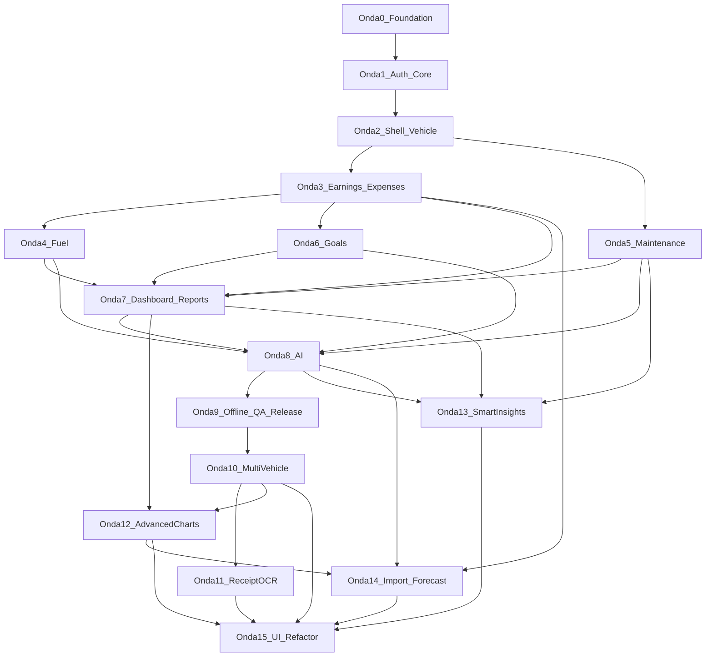
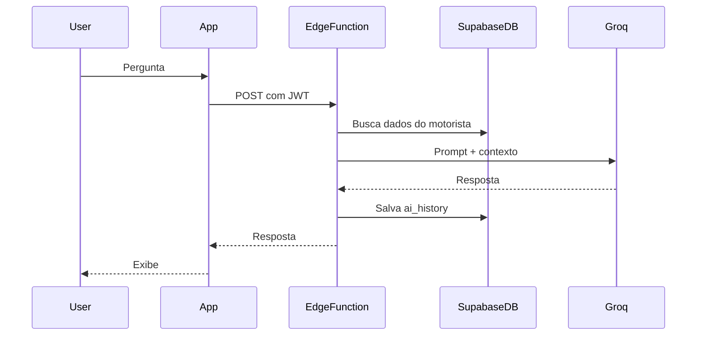

# DriveFlow — implementation-plan.md

Plano de implementação em **16 ondas** (0–15) para o DriveFlow (Flutter + Supabase + Groq), partindo de repositório vazio, combinando Clean Architecture feature-first do escopo com os padrões de organização do projeto MesclaInvest (screens/widgets/services separados, shell de navegação, mappers, test hooks).

**Fases:** ondas **0–9** = MVP v1.0 · ondas **10–14** = features pós-MVP (v1.5 → v2.0) · onda **15** = refatoração de UI / Design System v2 · onda **16** = UI Excellence · onda **17** = Premium UI FitCal/FitFolio tier.

**Repositório:** `driveflow`  
**Referência:** `ES-PI3-2026-T2-G03` (MesclaInvest)

---

## Progresso das ondas

| Onda | Descrição | Status |
|------|-----------|--------|
| 0 | Scaffold Flutter + Supabase migrations/RLS + theme/router base | concluída |
| 1 | Authentication (email + Google) + auth gate + profiles sync | concluída |
| 2 | Main shell (5 abas) + vehicle CRUD + onboarding obrigatório | concluída |
| 3 | Earnings + Expenses CRUD com upload de comprovantes | concluída |
| 4 | Fuel logs com cálculos km/L, custo/km e sync com expenses | concluída |
| 5 | Maintenance CRUD + lembretes locais (RF12) | concluída |
| 6 | Goals (diária/semanal/mensal/anual) + progresso visual | concluída |
| 7 | Dashboard agregado + Reports com export PDF/CSV | concluída |
| 8 | Edge Function Groq + AI chat UI + ai_history | concluída |
| 9 | Offline-first Hive sync + Analytics/Crashlytics + 70% coverage + release prep | concluída |
| 10 | Múltiplos veículos + seletor ativo + escopo por veículo | pendente |
| 11 | OCR de comprovantes + preenchimento automático de despesas | pendente |
| 12 | Gráficos avançados + comparação de períodos | concluída |
| 13 | Lembretes inteligentes + insights de melhor horário | concluída |
| 14 | Importação de extratos + previsão IA | concluída |
| 15 | Refatoração de UI / Design System v2 | concluída |
| 16 | UI Excellence — paleta azul-claro, tipografia premium, motion auth | concluída |
| 17 | Premium UI — FitCal/FitFolio tier (hero ring, mesh, editorial auth) | em andamento |

---

## Princípios de arquitetura

### Estrutura alvo (`lib/`)

```
lib/
├── main.dart
├── app.dart                          # MaterialApp.router + ProviderScope
├── supabase_dev_setup.dart           # URLs locais / dart-define (espelha firebase_dev_setup.dart)
│
├── core/
│   ├── theme/                        # app_colors, app_theme, theme_mode (Riverpod)
│   ├── router/                       # go_router, guards, transitions
│   ├── constants/                    # k-prefix, enums compartilhados
│   ├── services/                     # connectivity, notifications, analytics
│   ├── utils/                        # formatters BRL, datas, validators
│   ├── errors/                       # Failure, AppException
│   └── network/                      # Dio client (Groq proxy interno se necessário)
│
├── features/
│   ├── authentication/
│   ├── dashboard/
│   ├── earnings/
│   ├── expenses/
│   ├── vehicle/
│   ├── maintenance/
│   ├── goals/
│   ├── reports/
│   ├── ai/
│   └── profile/
│
└── shared/
    ├── widgets/                      # driveflow_* prefix (espelha mescla_*)
    ├── models/                       # tipos cross-feature
    └── providers/                    # supabaseClient, hive boxes
```

### Estrutura interna de cada feature (Clean Architecture)

Padrão MesclaInvest adaptado: **screens/widgets separados**, **schema + mapper explícitos**, **injeção para testes**.

```
features/<feature>/
├── presentation/
│   ├── screens/          # *_screen.dart
│   ├── widgets/          # componentes da feature + *_screen_widgets.dart se grande
│   └── providers/        # Riverpod (@riverpod)
├── domain/
│   ├── entities/         # Freezed, imutáveis
│   ├── repositories/     # interfaces abstratas
│   └── usecases/         # um caso de uso por ação
└── data/
    ├── datasources/      # remote (Supabase) + local (Hive)
    ├── models/           # DTOs com json_serializable
    ├── mappers/          # supabase_row_mapper.dart (espelha *_firestore_mapper.dart)
    ├── schema/           # column constants (espelha *_firestore_schema.dart)
    └── repositories/     # implementações
```

### Padrões herdados do MesclaInvest

| MesclaInvest | DriveFlow |
|---|---|
| `lib/<feature>/screens/` | `features/<feature>/presentation/screens/` |
| `lib/<feature>/services/` | `data/datasources/` + `data/repositories/` |
| `*_firestore_schema.dart` | `data/schema/<entity>_schema.dart` |
| `*_firestore_mapper.dart` | `data/mappers/<entity>_mapper.dart` |
| `mescla_main_shell.dart` | `shared/widgets/driveflow_main_shell.dart` |
| `*ForTesting` nos screens | Mesmo hook nos construtores |
| `test/` flat | `test/<feature>_<unit>_test.dart` |
| `firebase_dev_setup.dart` | `supabase_dev_setup.dart` |

### Stack confirmada (MVP)

- **Flutter** + Dart ^3.11
- **Riverpod** (codegen) + **Flutter Hooks**
- **GoRouter** (auth redirect + shell routes)
- **Supabase** (Auth, Postgres, RLS, Storage, Edge Functions)
- **Hive** (offline-first + fila de sync)
- **Freezed** + **json_serializable** + **build_runner**
- **Dio** (Edge Function proxy / uploads)
- **Groq API** via **Supabase Edge Function** (API key nunca no client)
- **Firebase Analytics** + **Crashlytics**
- **flutter_local_notifications** (lembretes de manutenção)

---

## Diagrama de dependências entre ondas



---

## Onda 0 — Fundação do projeto

**Objetivo:** Repositório compilável com arquitetura, tooling e backend Supabase versionado.

### Entregas Flutter

- `flutter create` com org/package `com.driveflow.app` (ou preferência do time)
- [pubspec.yaml](pubspec.yaml): todas as deps do escopo + `flutter_lints`, `build_runner`, `riverpod_generator`, `custom_lint`
- Pastas `core/`, `features/`, `shared/` conforme estrutura acima
- [analysis_options.yaml](analysis_options.yaml) strict
- [app.dart](lib/app.dart): `ProviderScope` + `MaterialApp.router`
- Theme base: `core/theme/app_colors.dart`, `app_theme.dart` (light/dark, alto contraste)
- Constantes: plataformas (Uber, 99…), categorias de despesa
- `core/errors/failure.dart`, `core/utils/currency_formatter.dart`, `date_utils.dart`

### Entregas Supabase (`supabase/`)

```
supabase/
├── config.toml
├── migrations/
│   └── 001_initial_schema.sql
└── functions/
    └── (vazio até Onda 8)
```

**Migration 001** — tabelas do escopo + índices + triggers `updated_at`:

- `profiles` (estende auth.users: name, photo, created_at)
- `vehicles`, `earnings`, `expenses`, `fuel_logs`, `maintenance`, `goals`, `ai_history`

**RLS:** policy `auth.uid() = user_id` (ou via join em `vehicles`) em todas as tabelas.

**Storage buckets:** `receipts` (comprovantes), `avatars` — policies por usuário.

### Critérios de conclusão

- App abre tela placeholder via GoRouter
- `flutter analyze` sem erros
- Supabase local sobe com `supabase start` e migration aplicada
- README com setup (Flutter, Supabase CLI, env vars)

---

## Onda 1 — Autenticação e bootstrap

**Objetivo:** Login email + Google, sessão persistida, gate de auth.

### Feature `authentication`

| Camada | Arquivos principais |
|---|---|
| Domain | `UserEntity`, `AuthRepository`, `SignInWithEmail`, `SignInWithGoogle`, `SignOut`, `WatchAuthState` |
| Data | `SupabaseAuthDataSource`, `ProfileRemoteDataSource`, `user_mapper.dart`, `profile_schema.dart` |
| Presentation | `splash_screen.dart`, `auth_gate_screen.dart`, `login_screen.dart`, `register_screen.dart` |
| Providers | `authStateProvider`, `authControllerProvider` |

### Fluxo de navegação (espelha MesclaInvest)

```
Splash → AuthGate → Login/Register → (onboarding futuro) → Shell
```

- GoRouter redirect: não autenticado → `/login`; autenticado em `/login` → `/`
- `flutter_secure_storage` para refresh token backup se necessário
- Sync de `profiles` no primeiro login (upsert)

### Edge cases

- Mensagens de erro amigáveis (`AuthFailure.messageForError` — padrão MesclaInvest)
- Loading states nos botões Google/email

### Testes

- Unit: mappers, validators de email/senha
- Widget: `login_screen_test.dart` com `authRepositoryForTesting`

### Critérios de conclusão

- Cadastro, login, logout funcionando em Android/iOS
- Perfil criado no Supabase após registro
- RLS impede leitura de dados de outro usuário

---

## Onda 2 — Shell principal e veículo

**Objetivo:** App navegável pós-login + cadastro obrigatório de veículo (onboarding).

### Shell de navegação

Inspirado em `mescla_main_shell.dart` (MesclaInvest):

- `shared/widgets/driveflow_main_shell.dart` — bottom nav com 5 abas MVP:
  1. **Dashboard** (home)
  2. **Ganhos**
  3. **Despesas**
  4. **Relatórios**
  5. **Perfil**
- Abas mantidas vivas (Stack animado ou IndexedStack)
- `core/router/transitions.dart` — fade+slide (espelha `mescla_material_route.dart`)
- Placeholder screens por aba

### Feature `vehicle`

Campos MVP: marca, modelo, ano, placa (opcional), combustível, consumo médio, tanque, quilometragem.

- CRUD completo
- Tela de onboarding: se `vehicles` vazio → forçar cadastro antes do shell
- Provider `activeVehicleProvider` (MVP: 1 veículo; schema já preparado para v1.5 multi-veículo)

### Feature `profile` (parcial)

- Exibir nome, email, foto
- Editar nome; upload foto → Storage `avatars`
- Link para editar veículo

### Testes

- Widget: shell troca abas
- Unit: `vehicle_mapper`, validação odômetro

### Critérios de conclusão

- Usuário logado sem veículo → onboarding → shell
- Veículo persistido com RLS
- Navegação fluida entre abas

---

## Onda 3 — Ganhos e despesas

**Objetivo:** CRUD manual de receitas e despesas — base de todo cálculo financeiro.

### Feature `earnings`

Campos: plataforma, valor, horário/data, quantidade de corridas, horas trabalhadas, observação.

- Listagem por período (hoje / semana / mês)
- Formulário create/edit/delete
- Filtro por plataforma

### Feature `expenses`

Campos: valor, categoria (enum do escopo), descrição, foto comprovante, data.

- Upload comprovante → Storage `receipts` → `receipt_url`
- `image_picker` + preview
- Listagem agrupada por categoria

### Camada data (padrão schema + mapper)

Exemplo para earnings:

- `earnings_schema.dart` — constantes de colunas Supabase
- `earnings_mapper.dart` — `Map<String,dynamic>` ↔ `EarningModel` ↔ `EarningEntity`
- `EarningsRemoteDataSource`, `EarningsLocalDataSource` (Hive box preparada, sync na Onda 9)

### Providers

- `earningsListProvider(dateRange)`
- `expensesListProvider(dateRange)`
- `earningsControllerProvider` / `expensesControllerProvider` para mutations

### Testes

- Unit: use cases, mappers, totais por período
- Widget: formulários com validação BRL

### Critérios de conclusão

- CRUD completo ganhos/despesas
- Comprovante upload/download seguro
- Listagens refletem dados em tempo real (Supabase stream ou pull-on-focus)

---

## Onda 4 — Abastecimento

**Objetivo:** Registro de combustível com métricas automáticas.

> Abastecimento é feature dedicada (não apenas categoria de despesa), mas **também gera registro em `expenses` categoria Combustível** para relatórios unificados.

### Feature `fuel` (sub-feature ou pasta dentro de `vehicle`)

Campos: posto, combustível, preço/litro, quantidade, valor total, odômetro.

**Cálculos automáticos:**

- `kmPorLitro` = delta odômetro / litros (quando há abastecimento anterior)
- `custoPorKm` = valor total / delta odômetro
- Média histórica rolling (últimos N abastecimentos)

- Atualizar `vehicles.odometer` ao salvar
- Card "último abastecimento" (consumido no Dashboard — Onda 7)

### UI

- `fuel_log_screen.dart` — formulário
- `fuel_history_screen.dart` — lista com métricas
- Acesso via Perfil/Veículo ou atalho no Dashboard

### Testes

- Unit: fórmulas km/L, custo/km, edge cases (primeiro abastecimento, odômetro inválido)

### Critérios de conclusão

- Métricas corretas com 2+ abastecimentos
- Despesa de combustível espelhada automaticamente
- Odômetro do veículo atualizado

---

## Onda 5 — Manutenção

**Objetivo:** Registro de manutenções + lembretes.

### Feature `maintenance`

Tipos: óleo, pneus, revisão, filtros, alinhamento, bateria, freios.

Campos: tipo, custo, data, `next_due_km`, `next_due_date`, observação.

- CRUD + histórico por veículo
- **Lembretes:** `flutter_local_notifications` agendados ao salvar (data e/ou km)
- Badge/alerta no Dashboard quando manutenção próxima (RF12)

### Domain

- `MaintenanceDueChecker` — verifica due by date e by km vs odômetro atual

### Testes

- Unit: lógica de due (data passada, km excedido, tolerância)

### Critérios de conclusão

- Notificação local dispara no prazo configurado
- Lista mostra status (ok / próximo / atrasado)

---

## Onda 6 — Metas

**Objetivo:** Metas diária/semanal/mensal/anual com progresso visual.

### Feature `goals`

- Tabela `goals` — 1 row por usuário (upsert)
- Campos: daily, weekly, monthly, yearly (valores BRL)
- UI: sliders ou inputs + cards de progresso circular/linear
- Cálculo de progresso: comparar meta vs lucro real do período (ganhos − despesas)

### Providers

- `goalsProvider`
- `goalProgressProvider(period)` — reutilizado no Dashboard e IA

### Testes

- Unit: cálculo % progresso, projeção "faltam R$ X"

### Critérios de conclusão

- Metas persistidas e progresso atualiza ao registrar ganhos/despesas
- Indicadores visuais claros (acessibilidade: contraste + semantics)

---

## Onda 7 — Dashboard e relatórios

**Objetivo:** Visão consolidada + exportação — coração do valor para o motorista.

### Feature `dashboard`

**Card "Hoje":** ganhos, gastos, lucro, horas, km, corridas, meta diária (%).

**Extras:**

- Gráfico semanal (barras ou linha — reutilizar padrão de charts do MesclaInvest)
- Resumo do mês
- Último abastecimento
- Alertas de manutenção

**Domain services (shared):**

- `ProfitCalculator` — lucro, lucro/hora, lucro/km
- `DashboardAggregator` — consolida queries paralelas

### Feature `reports`

Períodos: dia, semana, mês, ano.

Indicadores: receita, despesa, lucro, lucro/hora, lucro/km, combustível.

**Exportação:**

- PDF: `pdf` package — layout branded DriveFlow
- CSV: export raw + agregados
- Share via `share_plus`

### Performance

- Queries Supabase com filtros indexados por `user_id + date`
- Cache Hive para dashboard "hoje" (offline preview na Onda 9)
- Prefetch antes de navegar (padrão `MesclaNavigationPrefetch`)

### Testes

- Unit: agregações, lucro/hora, lucro/km
- Widget: dashboard com dados mock injetados

### Critérios de conclusão

- Dashboard carrega em < 2s com 90 dias de dados (RNF)
- PDF/CSV gerados e compartilháveis
- Gráfico semanal correto

---

## Onda 8 — Inteligência Artificial (Groq)

**Objetivo:** Chat contextual — diferencial do produto.

### Backend — Edge Function `ai-chat`

```
supabase/functions/ai-chat/index.ts
```

- Recebe: `question`, `userId`
- Busca contexto agregado (server-side, service role): ganhos, despesas, metas, fuel, maintenance dos últimos 90 dias
- Monta system prompt com regras (responder em PT-BR, usar BRL, citar números)
- Chama Groq API (Llama 3.3 70B default; fallback Kimi/DeepSeek via env)
- Persiste em `ai_history`
- Rate limit por usuário

**Segurança:** `GROQ_API_KEY` só na Edge Function; validar JWT do caller.

### Feature `ai`

- `ai_chat_screen.dart` — UI estilo chat (bolhas, histórico)
- Sugestões rápidas: "Quanto lucrei este mês?", "Vale abastecer agora?", etc.
- `AiContextBuilder` (domain) — formata snapshot para debug/local preview
- Histórico local + sync `ai_history`

### Fluxo



### Testes

- Unit: `AiContextBuilder` com fixtures JSON
- Integration: mock Groq response
- Edge Function: teste com Deno (payload mínimo)

### Critérios de conclusão

- 5 perguntas exemplos do escopo respondidas corretamente com dados reais
- Histórico persistido
- API key nunca exposta no APK/IPA

---

## Onda 9 — Offline, observabilidade, QA e release

**Objetivo:** Produção-ready MVP v1.0.

### Offline-first (RNF)

- Hive boxes: `earnings`, `expenses`, `fuel_logs`, `maintenance`, `goals`, `pending_sync_queue`
- Pattern write-through: salva local → enqueue → sync Supabase quando online
- `connectivity_plus` + `SyncWorker` com retry exponencial
- UI: banner "offline" / "sincronizando"

### Observabilidade

- Firebase Analytics: eventos (`earning_added`, `ai_question`, `report_exported`)
- Crashlytics: `FlutterError.onError`, `runZonedGuarded`
- Logs estruturados em debug only

### Qualidade

- **70% coverage** domain + data (`flutter test --coverage`)
- Widget tests para telas críticas (auth, dashboard, forms)
- Acessibilidade: contraste WCAG AA, `Semantics`, targets ≥ 48dp (uso com uma mão)
- iOS 15+ / Android 8+ smoke test

### Polish

- Empty states ilustrados
- Skeleton loaders
- Pull-to-refresh nas listas
- Internacionalização prep: `intl` pt_BR

### Documentação

- [README.md](README.md) completo (setup, env, arquitetura)
- Diagrama ER Supabase
- Checklist de release (icons, splash, store listings)

### Critérios de conclusão

- App funciona offline para CRUD + sync ao reconectar
- Coverage ≥ 70% domain/data
- Crashlytics ativo
- MVP v1.0 checklist do escopo 100% RF01–RF13

---

## Onda 10 — Múltiplos veículos

**Objetivo:** Suportar mais de um veículo por usuário com seletor ativo e dados escopados — base para v1.5.

> O schema MVP já prevê `vehicle_id` em `fuel_logs` e `maintenance`; esta onda generaliza o escopo e remove a limitação de 1 veículo em `activeVehicleProvider`.

### Migration 002 (`supabase/migrations/002_multi_vehicle.sql`)

- `vehicles`: colunas `nickname text`, `is_default boolean default false`
- Constraint: no máximo 1 `is_default = true` por `user_id` (partial unique index)
- `earnings` / `expenses`: coluna opcional `vehicle_id uuid references vehicles` (nullable para registros legados)
- Índices: `vehicles_user_id_default_idx`, `earnings_vehicle_id_date_idx`

### Feature `vehicle` (extensão)

| Camada | Entregas |
|---|---|
| Domain | `SetActiveVehicle`, `ListUserVehicles`, `DeleteVehicle` (com reassign de default) |
| Data | `VehiclesLocalDataSource` (Hive box `vehicles`), sync na fila existente |
| Presentation | `vehicle_picker_sheet.dart`, chip no AppBar do shell, lista em Perfil |

### Providers e escopo

- `vehiclesListProvider` — todos os veículos do usuário
- `activeVehicleProvider` — veículo selecionado (persistido em Hive + `profiles` metadata opcional)
- `scopedVehicleIdProvider` — injetado em fuel, maintenance, dashboard e reports
- Onboarding: permite pular se já houver veículo; fluxo "adicionar veículo" separado do primeiro cadastro

### Impacto cross-feature

- **Fuel / Maintenance:** já filtram por `vehicle_id` — passam a usar veículo ativo
- **Dashboard / Reports:** filtro "Todos" vs veículo específico; odômetro e alertas por veículo
- **Goals:** mantém meta por usuário (MVP v1.5); nota no plano para meta por veículo em v2.1

### Testes

- Unit: reassign de default, delete com fallback, mapper com `nickname`
- Widget: seletor troca dados exibidos no dashboard

### Critérios de conclusão

- CRUD de N veículos com 1 default
- Troca de veículo ativo reflete fuel, maintenance, dashboard e relatórios em < 500 ms
- Offline: veículo ativo e lista cacheados; sync ao reconectar

---

## Onda 11 — OCR de comprovantes

**Objetivo:** Reduzir fricção no cadastro de despesas via leitura automática de comprovantes (v1.5).

### Feature `receipt_ocr` (sub-feature de `expenses`)

```
features/expenses/
├── domain/services/receipt_ocr_parser.dart   # normaliza texto → campos
├── data/datasources/receipt_ocr_datasource.dart
└── presentation/widgets/receipt_scan_review_sheet.dart
```

### Pipeline OCR

1. `image_picker` / câmera → imagem local
2. **Opção A (preferida offline):** `google_mlkit_text_recognition` no device
3. **Opção B (fallback cloud):** Edge Function `receipt-ocr` com vision API (somente se ML Kit falhar)
4. `ReceiptOcrParser` extrai: valor BRL, data, estabelecimento (heurísticas + regex pt_BR)
5. UI de revisão: usuário confirma/edita antes de `CreateExpense`

### Campos auto-preenchidos

- `amount`, `date`, `description` (nome do estabelecimento)
- `category` sugerida por palavras-chave (combustível, pedágio, alimentação…)
- `receipt_url` — upload após confirmação (fluxo existente)

### UX

- Botão "Escanear comprovante" no `expense_form_screen.dart`
- Preview da imagem + campos destacados com confidence baixa
- Analytics: `receipt_ocr_scanned`, `receipt_ocr_confirmed`, `receipt_ocr_discarded`

### Testes

- Unit: parser com fixtures de texto OCR (nota fiscal, cupom posto, recibo genérico)
- Widget: fluxo scan → revisão → salvar com mock datasource

### Critérios de conclusão

- ≥ 80% de acerto em valor e data em cupons de teste do time
- Nenhuma despesa salva sem confirmação explícita do usuário
- Funciona offline com ML Kit (sem enviar imagem à nuvem por padrão)

---

## Onda 12 — Gráficos avançados e comparação de períodos

**Objetivo:** Análises visuais além do gráfico semanal do MVP — tendências, distribuição e benchmarks temporais (v1.5 / v2.0).

### Feature `analytics` (nova) + extensões em `dashboard` e `reports`

```
features/analytics/
├── domain/services/period_comparison_calculator.dart
├── domain/services/category_breakdown_calculator.dart
├── presentation/widgets/
│   ├── profit_trend_chart.dart      # linha 30/90 dias
│   ├── expense_pie_chart.dart       # despesa por categoria
│   └── period_comparison_card.dart  # mês atual vs anterior
└── presentation/screens/analytics_screen.dart
```

### Gráficos (`fl_chart`)

| Gráfico | Dados | Local |
|---|---|---|
| Linha de lucro | lucro diário, 30/90 dias | Analytics + Dashboard (expandível) |
| Pizza despesas | % por categoria no período | Relatórios + Analytics |
| Barras comparativas | período A vs B (receita, despesa, lucro) | Analytics |
| Heatmap horário | ganho médio por hora/dia da semana | Analytics (prep Onda 13) |

### `PeriodComparisonCalculator`

- Entrada: `DateRangePeriod` atual + período de referência (anterior, mesmo mês ano passado)
- Saída: delta absoluto e % para receita, despesa, lucro, lucro/hora, lucro/km
- Reutiliza `ProfitCalculator` e `DashboardAggregator`

### Navegação

- Dashboard: link "Ver análises" → `/analytics`
- Relatórios: seção "Comparar períodos" com seletor customizado

### Performance

- Agregações server-side opcionais via RPC Supabase (`get_period_summary`) se volume > 10k rows
- Cache Hive por `(userId, period, vehicleId)` com TTL 15 min

### Testes

- Unit: comparação períodos, breakdown por categoria, edge cases (período vazio)
- Widget: `period_comparison_card` com dados mock

### Critérios de conclusão

- 4 tipos de gráfico renderizam com dados reais em < 1,5 s
- Comparação mês atual vs anterior correta em cenários de teste
- Export PDF/CSV inclui seção de comparação (extensão do gerador existente)

---

## Onda 13 — Lembretes inteligentes e insights operacionais

**Objetivo:** Manutenção preditiva e recomendações de horário de trabalho com base nos dados reais do motorista (v1.5 / v2.0).

### Feature `insights` (nova) + extensões em `maintenance` e `dashboard`

### Lembretes inteligentes de manutenção

- `MaintenancePredictor` — estima `next_due_km` e `next_due_date` usando:
  - média de km/dia (odômetro + histórico fuel)
  - tipo de manutenção e intervalos sugeridos (tabela local de defaults)
- Notificações locais reagendadas quando padrão de uso muda
- Badge no Dashboard: "Óleo em ~5 dias" com confidence

### Melhor horário para trabalhar

- `EarningsHeatmapBuilder` — agrega ganhos por `(dia_semana, hora)` dos últimos 60 dias
- Card no Dashboard: top 3 janelas de maior lucro/hora
- Sugestões rápidas na IA: "Qual meu melhor horário?" com dados do heatmap

### Edge Function (opcional) `insights-summary`

- Pré-computa heatmap e previsões de manutenção server-side para usuários com muito histórico
- Rate limit; fallback 100% local se offline

### UI

- `/insights` acessível via Dashboard e Perfil
- Cards: melhor horário, manutenção prevista, projeção de meta semanal

### Testes

- Unit: `MaintenancePredictor`, heatmap com fixtures, tolerância de km/dia
- Widget: card de melhor horário com semantics

### Critérios de conclusão

- Previsão de manutenção dentro de ±15% do vencimento real em simulações
- Heatmap reflete corretamente dados de ganhos com hora registrada
- Notificações reagendam após novo abastecimento que altera média km/dia

---

## Onda 14 — Importação de extratos e previsão IA

**Objetivo:** Entrada em massa de transações e projeções financeiras assistidas por IA (v2.0).

### Feature `import` (nova)

```
features/import/
├── domain/services/csv_statement_parser.dart
├── domain/services/import_deduplicator.dart
├── data/datasources/import_remote_datasource.dart
└── presentation/screens/import_statement_screen.dart
```

### Importação de extratos

- Formatos: CSV (Nubank, Inter, genérico), OFX básico
- Mapeamento de colunas: data, descrição, valor, tipo (crédito/débito)
- Preview em tabela com checkboxes; categorização sugerida (regras + IA leve)
- `ImportDeduplicator` — evita duplicatas por `(date, amount, description hash)`
- Bulk insert via fila offline existente (`pending_sync_queue`)

### Previsão IA

- Extensão Edge Function `ai-chat` ou função dedicada `ai-forecast`:
  - entrada: séries de lucro 90 dias, metas, sazonalidade
  - saída: projeção 7/30 dias, cenário otimista/pessimista, texto em PT-BR
- UI: card "Projeção" em Analytics + pergunta sugerida no chat
- Persistência opcional em `ai_history` com `type = forecast`

### Segurança

- Arquivos CSV processados apenas em memória; não persistir extrato bruto no servidor
- Validação de tamanho (máx. 5 MB) e linhas (máx. 2 000)

### Testes

- Unit: parsers CSV/OFX, deduplicação, projeção com fixtures
- Integration: import 100 linhas → fila sync → Supabase

### Critérios de conclusão

- Importar CSV de teste com ≥ 95% de linhas mapeadas corretamente
- Previsão IA retorna números coerentes com histórico mock
- Import offline enfileira e sincroniza ao reconectar

---

## Onda 15 — Refatoração de UI / Design System v2

**Objetivo:** Consolidar a interface pós-features (ondas 10–14) em um design system coeso, acessível e fácil de manter — **sem novas features de negócio**.

> Executar **após** as ondas 10–14 para evitar retrabalho em telas que ainda mudam de escopo.

### Design tokens (`core/theme/`)

| Arquivo | Conteúdo |
|---|---|
| `app_spacing.dart` | escala 4/8/12/16/24/32/48 |
| `app_radius.dart` | `sm/md/lg/xl` (12/16/20/28) |
| `app_motion.dart` | durações, curvas, `DriveFlowMotion` |
| `app_elevation.dart` | sombras glass + M3 |
| `app_semantic_colors.dart` | success/warning/error/info além de `app_colors` |

### Biblioteca de componentes (`shared/widgets/design_system/`)

Migrar e padronizar widgets existentes `driveflow_*`:

| Componente | Substitui / unifica |
|---|---|
| `df_button.dart` | `auth_primary_button`, FABs ad hoc |
| `df_text_field.dart` | `auth_text_field`, inputs de formulário |
| `df_card.dart` | `driveflow_glass_card`, cards inline |
| `df_chip.dart` | `driveflow_metric_chip`, filtros |
| `df_empty_state.dart` | `driveflow_empty_state` |
| `df_skeleton.dart` | `driveflow_list_skeleton` |
| `df_section_header.dart` | títulos repetidos em screens |
| `df_bottom_sheet.dart` | sheets de picker, OCR review, vehicle picker |

Prefixo interno `Df*` nos novos primitives; wrappers `driveflow_*` mantidos como aliases deprecated até remoção em v2.1.

### Refatoração de screens

- Extrair widgets de screens > 250 linhas para `*_screen_widgets.dart` ou `widgets/`
- Alvos prioritários: `dashboard_screen`, `earnings_screen`, `expenses_screen`, `reports_screen`, `ai_chat_screen`
- Formulários: layout compartilhado `df_form_scaffold.dart` (app bar, scroll, ações fixas)

### Acessibilidade e polish

- Auditoria WCAG AA → corrigir contrastes em chips e gráficos
- `Semantics` em todos os gráficos (`fl_chart` wrappers)
- Touch targets ≥ 48 dp em ações secundárias
- Suporte a `textScaleFactor` 1.3 sem overflow (testes widget)
- Reduzir rebuilds: `const` constructors, `RepaintBoundary` em charts

### Internacionalização (prep)

- Extrair strings para `lib/l10n/app_pt.arb` (sem segundo idioma ainda)
- Datas e moeda já usam `intl` — alinhar mensagens de erro/auth

### Navegação e shell

- Unificar padrão de `SliverAppBar` / título em todas as abas
- Animações de entrada consistentes via `app_motion.dart`
- Dark mode: revisar gradientes `AppColors.ambientGradient` e bordas glass

### Testes e critérios

- Golden tests para `df_button`, `df_card`, `df_empty_state` (light + dark)
- Widget: smoke de cada aba após migração de componentes
- `flutter analyze` sem deprecations nos wrappers antigos
- Nenhuma regressão visual nas 5 abas + fluxos OCR/import/analytics

### Critérios de conclusão

- ≥ 90% das telas usam tokens (`spacing`, `radius`, `motion`) — sem magic numbers novos
- Biblioteca `design_system/` documentada no README (tabela de componentes)
- Screens prioritárias abaixo de 200 linhas cada
- Acessibilidade: checklist WCAG AA do escopo atendido

---

## Onda 16 — UI Excellence (paleta azul-claro + motion + auth polish)

**Objetivo:** Elevar a interface para uso diário intensivo — referências **Cupertino**, **Material Design 3** e apps fintech de alta engenharia. Eliminar aparência "wide-coding", fechar lacunas alpha no fluxo de auth e entregar motion consistente.

> Executar **após** onda 15. Sem novas features de negócio — apenas polish visual e UX.

### Paleta de cores (azul-claro como primária)

| Token | Hex | Uso |
|---|---|---|
| `skyBlue` | `#5BA4F5` | Primária (dark mode, acentos) |
| `skyBlueDim` | `#3B8AE8` | Primária (light mode, botões) |
| `skyBlueSoft` | `#93C5FD` | Glow, chips, estados hover |
| `deepNavy` | `#0A0E17` | Fundo dark (mantido) |
| `profitGreen` | `#34D399` | Sucesso / lucro (mantido — feedback positivo) |
| `iceBackground` | `#F0F7FF` → `#EBF4FF` | Gradiente light mode |

Substituir `electricTeal` como cor de marca por tons de azul-claro. Verde permanece apenas em semântica de lucro/sucesso.

### Tipografia (sem fontes de código)

| Papel | Fonte | Motivo |
|---|---|---|
| Display / headlines | **Plus Jakarta Sans** | Geométrica, moderna — usada em fintechs premium |
| Body / labels | **Inter** | Legibilidade diária, neutra e profissional |
| Números / métricas | **Inter** (tabular figures) | Substituir JetBrains Mono — evita look "dev tool" |

### Componentes novos (`shared/widgets/design_system/`)

| Componente | Função |
|---|---|
| `df_password_checklist.dart` | Checklist animado de requisitos de senha (8+ chars, maiúscula, minúscula, número) |
| `df_staggered_entrance.dart` | Entrada escalonada fade+slide para formulários auth |

### Auth — lacunas alpha fechadas

| Lacuna | Solução |
|---|---|
| Sem checklist de senha no cadastro | `DfPasswordChecklist` com ✓ animados em tempo real |
| Transição login ↔ cadastro sem motion | Slide horizontal Cupertino-style via `authSlidePage` no GoRouter |
| Labels ALL CAPS nos campos | `DfTextField` com label sentence-case e peso médio |
| Confirmar senha compartilha toggle | Toggle independente por campo |
| Skeleton estático | Shimmer animado em `DfSkeleton` |

### Motion e transições

- Auth routes: slide horizontal + fade (`DriveFlowMotion.normal` = 280ms)
- Formulários: `DfStaggeredEntrance` com delay 60ms entre campos
- Splash: scale + fade no logo (spring-like curve)
- Fundo: glow azul-claro no `DriveFlowGradientBackground`

### Critérios de conclusão

- Paleta azul-claro aplicada em `app_colors`, `app_theme`, logo e gradiente
- Zero uso de JetBrains Mono / Outfit em tipografia principal
- Checklist de senha visível e animado no `RegisterScreen`
- Transição animada login ↔ cadastro
- `flutter analyze` limpo + testes de auth/password checklist
- Commits atômicos por arquivo

---

## Onda 17 — Premium UI (referência FitCal / FitFolio)

**Objetivo:** Elevar DriveFlow ao patamar "outlier" de apps como **FitCal** (anel circular de métricas, dashboard limpo) e **FitFolio** (carrossel de atalhos, social-grade polish).

**Referências:** [FitFolio](https://apps.apple.com/br/app/fitfolio-app/id6745530812) · [FitCal](https://apps.apple.com/br/app/fitcal-calorie-counter/id6739812257)

### Padrões visuais adotados

| FitCal / FitFolio | DriveFlow |
|---|---|
| Calorie ring circular | `DfProgressRing` — anel de meta diária de lucro |
| Hero metric central | `DfHeroMetric` — lucro do dia em displayLarge |
| Macro pills (protein/carbs/fat) | Pills de Ganhos / Gastos no hero |
| Quick actions carousel | `DfShortcutTile` — carrossel horizontal (IA, Metas, etc.) |
| Editorial onboarding | `AuthHeroLayout` — headline grande + form card elevado |
| Mesh gradient background | `AppGradients.meshGlows` — fundo multi-radial animado |
| Gradient CTA buttons | `DfButtonVariant.gradient` com press-scale |

### Componentes novos

- `app_gradients.dart` — tokens de gradiente premium
- `df_progress_ring.dart` — anel animado com CustomPainter
- `df_hero_metric.dart` — tipografia editorial para métricas
- `df_shortcut_tile.dart` — tiles de atalho com press-scale
- `auth_hero_layout.dart` — shell auth editorial
- `dashboard_hero_section.dart` — hero ring + macros do dia

### Dashboard redesign

- Header: saudação contextual ("Boa noite, João") + avatar
- Hero: anel de progresso da meta + lucro central
- Atalhos: carrossel horizontal (5 ações)
- Cards secundários migrados para `DfCard`

### Critérios de conclusão

- Dashboard com hero ring visível na aba Início
- Auth com layout editorial (headline + card elevado)
- Bottom nav com labels sentence-case e animação de chip
- `flutter analyze` limpo + testes existentes passando

---

## Mapa de requisitos funcionais → ondas

| RF | Descrição | Onda |
|---|---|---|
| RF01 | Cadastro usuários | 1 |
| RF02 | Login | 1 |
| RF03 | Cadastro veículo | 2 |
| RF04 | Cadastro ganhos | 3 |
| RF05 | Cadastro despesas | 3 |
| RF06 | Abastecimentos | 4 |
| RF07 | Manutenções | 5 |
| RF08 | Metas | 6 |
| RF09 | Dashboard | 7 |
| RF10 | Relatórios | 7 |
| RF11 | IA | 8 |
| RF12 | Notificações manutenção | 5 (+ 13 lembretes inteligentes) |
| RF13 | Backup Supabase | 0–9 (RLS + sync) |
| RF14 | Múltiplos veículos | 10 |
| RF15 | OCR comprovantes | 11 |
| RF16 | Gráficos avançados | 12 |
| RF17 | Comparação de períodos | 12 |
| RF18 | Lembretes inteligentes | 13 |
| RF19 | Melhor horário / insights | 13 |
| RF20 | Importação extratos | 14 |
| RF21 | Previsão IA | 14 |
| RNF-UI | Design System v2 + acessibilidade | 15 |
| RNF-UI+ | UI Excellence — paleta, tipografia, motion auth | 16 |
| RNF-UI++ | Premium UI FitCal/FitFolio tier | 17 |

---

## Convenções de nomenclatura

| Elemento | Convenção | Exemplo |
|---|---|---|
| Package | `driveflow` | `package:driveflow/...` |
| Screens | `{name}_screen.dart` | `earnings_list_screen.dart` |
| Providers | `{name}Provider` | `earningsListProvider` |
| Use cases | verbo + entidade | `CreateEarning`, `GetDashboardSummary` |
| Schema | `{entity}_schema.dart` | `earnings_schema.dart` |
| Widgets shared | prefixo `driveflow_` | `driveflow_bottom_nav_bar.dart` |
| Constantes | prefixo `k` | `kPlatformUber` |
| Testes | `{alvo}_test.dart` | `profit_calculator_test.dart` |

---

## Variáveis de ambiente

```env
# Flutter (--dart-define-from-file)
SUPABASE_URL=
SUPABASE_ANON_KEY=

# Supabase Edge Functions (secrets)
GROQ_API_KEY=
GROQ_MODEL=llama-3.3-70b-versatile
```

---

## Roadmap pós-MVP (referência)

| Versão | Escopo | Ondas |
|---|---|---|
| **v1.5** | OCR, gráficos avançados, múltiplos veículos, lembretes inteligentes | 10–13 |
| **v2.0** | Importação extratos, previsão IA, melhor horário, comparação períodos | 12–14 |
| **v2.1** | Metas por veículo, remoção aliases `driveflow_*` deprecated | pós-15 |
| **v3.0** | Comunidade, parceiros, painel web | fora do plano atual |

---

## Ordem de execução recomendada

### MVP v1.0 (ondas 0–9)

Executar ondas **sequencialmente** (0 → 9). Dentro de cada onda, paralelizar quando possível:

- **Onda 3:** earnings e expenses em paralelo (devs diferentes)
- **Onda 7:** dashboard e reports em paralelo após aggregators prontos
- **Onda 9:** offline sync e testes podem avançar em paralelo

### Pós-MVP (ondas 10–15)

Executar **10 → 11 → 12 → 13 → 14 → 15** (a onda 15 é estritamente refatoração de UI e deve ser a última).

Paralelização permitida:

- **Onda 12 + 13:** após Onda 10 — analytics (gráficos) e insights (heatmap) em devs diferentes
- **Onda 14:** pode iniciar parser CSV em paralelo com Onda 13; previsão IA depende de Onda 8 + agregadores da 12
- **Onda 15:** somente após 10–14 mergeadas na branch principal

Cada onda termina com: `flutter analyze` + testes da onda + demo funcional antes de avançar.
