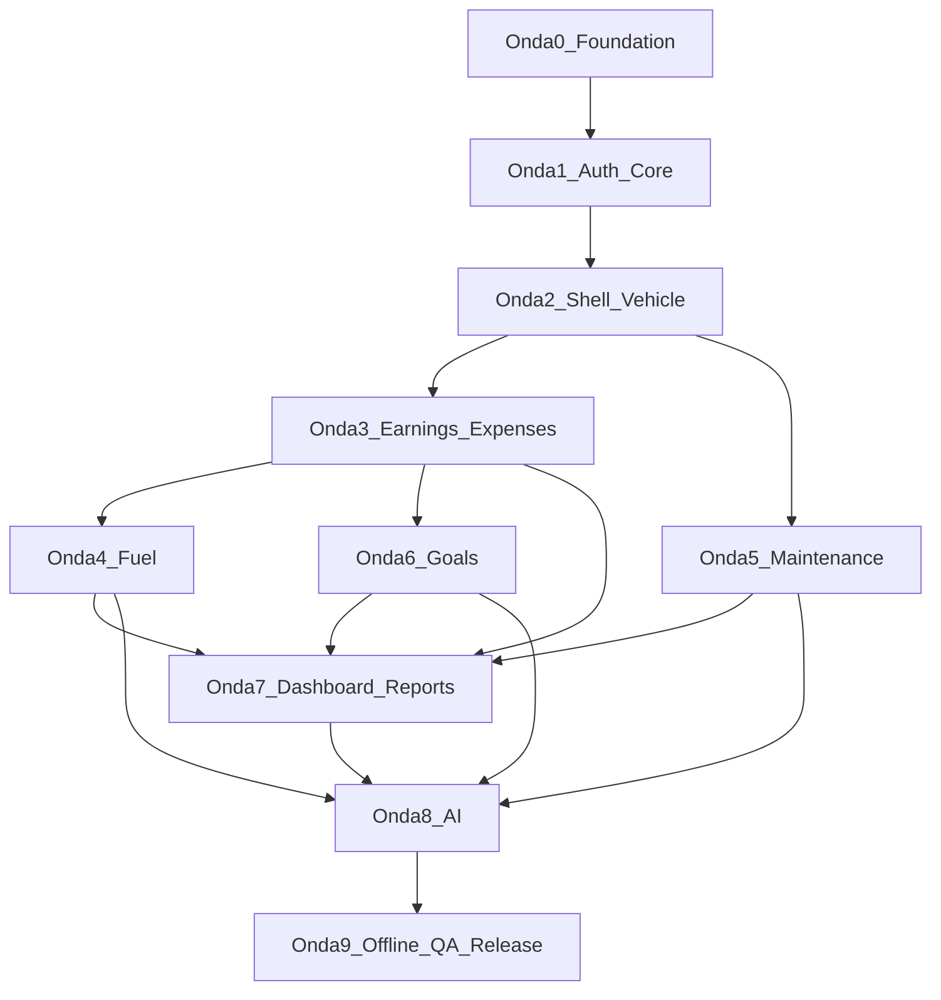
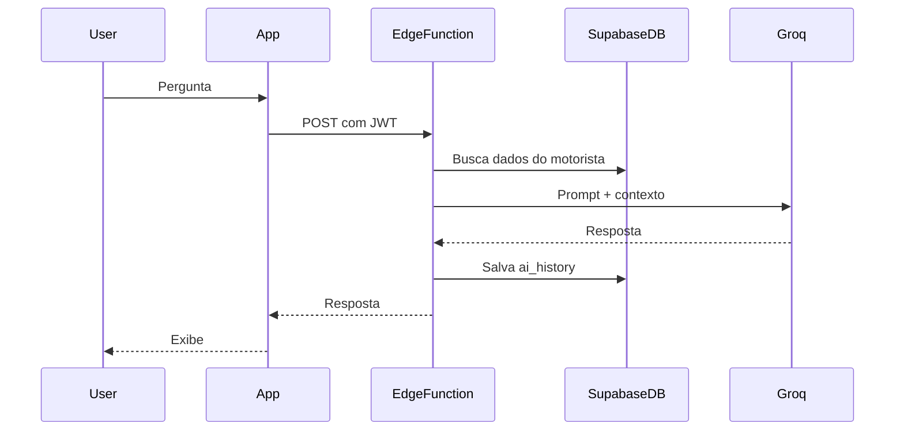

# DriveFlow — implementation-plan.md

Plano de implementação em 10 ondas para o DriveFlow (Flutter + Supabase + Groq), partindo de repositório vazio, combinando Clean Architecture feature-first do escopo com os padrões de organização do projeto MesclaInvest (screens/widgets/services separados, shell de navegação, mappers, test hooks).

**Repositório:** `driveflow`  
**Referência:** `ES-PI3-2026-T2-G03` (MesclaInvest)

---

## Progresso das ondas

| Onda | Descrição | Status |
|------|-----------|--------|
| 0 | Scaffold Flutter + Supabase migrations/RLS + theme/router base | concluída |
| 1 | Authentication (email + Google) + auth gate + profiles sync | concluída |
| 2 | Main shell (5 abas) + vehicle CRUD + onboarding obrigatório | concluída |
| 3 | Earnings + Expenses CRUD com upload de comprovantes | concluída |
| 4 | Fuel logs com cálculos km/L, custo/km e sync com expenses | pendente |
| 5 | Maintenance CRUD + lembretes locais (RF12) | pendente |
| 6 | Goals (diária/semanal/mensal/anual) + progresso visual | pendente |
| 7 | Dashboard agregado + Reports com export PDF/CSV | pendente |
| 8 | Edge Function Groq + AI chat UI + ai_history | pendente |
| 9 | Offline-first Hive sync + Analytics/Crashlytics + 70% coverage + release prep | pendente |

---

## Princípios de arquitetura

### Estrutura alvo (`lib/`)

```
lib/
├── main.dart
├── app.dart                          # MaterialApp.router + ProviderScope
├── supabase_dev_setup.dart           # URLs locais / dart-define (espelha firebase_dev_setup.dart)
│
├── core/
│   ├── theme/                        # app_colors, app_theme, theme_mode (Riverpod)
│   ├── router/                       # go_router, guards, transitions
│   ├── constants/                    # k-prefix, enums compartilhados
│   ├── services/                     # connectivity, notifications, analytics
│   ├── utils/                        # formatters BRL, datas, validators
│   ├── errors/                       # Failure, AppException
│   └── network/                      # Dio client (Groq proxy interno se necessário)
│
├── features/
│   ├── authentication/
│   ├── dashboard/
│   ├── earnings/
│   ├── expenses/
│   ├── vehicle/
│   ├── maintenance/
│   ├── goals/
│   ├── reports/
│   ├── ai/
│   └── profile/
│
└── shared/
    ├── widgets/                      # driveflow_* prefix (espelha mescla_*)
    ├── models/                       # tipos cross-feature
    └── providers/                    # supabaseClient, hive boxes
```

### Estrutura interna de cada feature (Clean Architecture)

Padrão MesclaInvest adaptado: **screens/widgets separados**, **schema + mapper explícitos**, **injeção para testes**.

```
features/<feature>/
├── presentation/
│   ├── screens/          # *_screen.dart
│   ├── widgets/          # componentes da feature + *_screen_widgets.dart se grande
│   └── providers/        # Riverpod (@riverpod)
├── domain/
│   ├── entities/         # Freezed, imutáveis
│   ├── repositories/     # interfaces abstratas
│   └── usecases/         # um caso de uso por ação
└── data/
    ├── datasources/      # remote (Supabase) + local (Hive)
    ├── models/           # DTOs com json_serializable
    ├── mappers/          # supabase_row_mapper.dart (espelha *_firestore_mapper.dart)
    ├── schema/           # column constants (espelha *_firestore_schema.dart)
    └── repositories/     # implementações
```

### Padrões herdados do MesclaInvest

| MesclaInvest | DriveFlow |
|---|---|
| `lib/<feature>/screens/` | `features/<feature>/presentation/screens/` |
| `lib/<feature>/services/` | `data/datasources/` + `data/repositories/` |
| `*_firestore_schema.dart` | `data/schema/<entity>_schema.dart` |
| `*_firestore_mapper.dart` | `data/mappers/<entity>_mapper.dart` |
| `mescla_main_shell.dart` | `shared/widgets/driveflow_main_shell.dart` |
| `*ForTesting` nos screens | Mesmo hook nos construtores |
| `test/` flat | `test/<feature>_<unit>_test.dart` |
| `firebase_dev_setup.dart` | `supabase_dev_setup.dart` |

### Stack confirmada (MVP)

- **Flutter** + Dart ^3.11
- **Riverpod** (codegen) + **Flutter Hooks**
- **GoRouter** (auth redirect + shell routes)
- **Supabase** (Auth, Postgres, RLS, Storage, Edge Functions)
- **Hive** (offline-first + fila de sync)
- **Freezed** + **json_serializable** + **build_runner**
- **Dio** (Edge Function proxy / uploads)
- **Groq API** via **Supabase Edge Function** (API key nunca no client)
- **Firebase Analytics** + **Crashlytics**
- **flutter_local_notifications** (lembretes de manutenção)

---

## Diagrama de dependências entre ondas



---

## Onda 0 — Fundação do projeto

**Objetivo:** Repositório compilável com arquitetura, tooling e backend Supabase versionado.

### Entregas Flutter

- `flutter create` com org/package `com.driveflow.app` (ou preferência do time)
- [pubspec.yaml](pubspec.yaml): todas as deps do escopo + `flutter_lints`, `build_runner`, `riverpod_generator`, `custom_lint`
- Pastas `core/`, `features/`, `shared/` conforme estrutura acima
- [analysis_options.yaml](analysis_options.yaml) strict
- [app.dart](lib/app.dart): `ProviderScope` + `MaterialApp.router`
- Theme base: `core/theme/app_colors.dart`, `app_theme.dart` (light/dark, alto contraste)
- Constantes: plataformas (Uber, 99…), categorias de despesa
- `core/errors/failure.dart`, `core/utils/currency_formatter.dart`, `date_utils.dart`

### Entregas Supabase (`supabase/`)

```
supabase/
├── config.toml
├── migrations/
│   └── 001_initial_schema.sql
└── functions/
    └── (vazio até Onda 8)
```

**Migration 001** — tabelas do escopo + índices + triggers `updated_at`:

- `profiles` (estende auth.users: name, photo, created_at)
- `vehicles`, `earnings`, `expenses`, `fuel_logs`, `maintenance`, `goals`, `ai_history`

**RLS:** policy `auth.uid() = user_id` (ou via join em `vehicles`) em todas as tabelas.

**Storage buckets:** `receipts` (comprovantes), `avatars` — policies por usuário.

### Critérios de conclusão

- App abre tela placeholder via GoRouter
- `flutter analyze` sem erros
- Supabase local sobe com `supabase start` e migration aplicada
- README com setup (Flutter, Supabase CLI, env vars)

---

## Onda 1 — Autenticação e bootstrap

**Objetivo:** Login email + Google, sessão persistida, gate de auth.

### Feature `authentication`

| Camada | Arquivos principais |
|---|---|
| Domain | `UserEntity`, `AuthRepository`, `SignInWithEmail`, `SignInWithGoogle`, `SignOut`, `WatchAuthState` |
| Data | `SupabaseAuthDataSource`, `ProfileRemoteDataSource`, `user_mapper.dart`, `profile_schema.dart` |
| Presentation | `splash_screen.dart`, `auth_gate_screen.dart`, `login_screen.dart`, `register_screen.dart` |
| Providers | `authStateProvider`, `authControllerProvider` |

### Fluxo de navegação (espelha MesclaInvest)

```
Splash → AuthGate → Login/Register → (onboarding futuro) → Shell
```

- GoRouter redirect: não autenticado → `/login`; autenticado em `/login` → `/`
- `flutter_secure_storage` para refresh token backup se necessário
- Sync de `profiles` no primeiro login (upsert)

### Edge cases

- Mensagens de erro amigáveis (`AuthFailure.messageForError` — padrão MesclaInvest)
- Loading states nos botões Google/email

### Testes

- Unit: mappers, validators de email/senha
- Widget: `login_screen_test.dart` com `authRepositoryForTesting`

### Critérios de conclusão

- Cadastro, login, logout funcionando em Android/iOS
- Perfil criado no Supabase após registro
- RLS impede leitura de dados de outro usuário

---

## Onda 2 — Shell principal e veículo

**Objetivo:** App navegável pós-login + cadastro obrigatório de veículo (onboarding).

### Shell de navegação

Inspirado em `mescla_main_shell.dart` (MesclaInvest):

- `shared/widgets/driveflow_main_shell.dart` — bottom nav com 5 abas MVP:
  1. **Dashboard** (home)
  2. **Ganhos**
  3. **Despesas**
  4. **Relatórios**
  5. **Perfil**
- Abas mantidas vivas (Stack animado ou IndexedStack)
- `core/router/transitions.dart` — fade+slide (espelha `mescla_material_route.dart`)
- Placeholder screens por aba

### Feature `vehicle`

Campos MVP: marca, modelo, ano, placa (opcional), combustível, consumo médio, tanque, quilometragem.

- CRUD completo
- Tela de onboarding: se `vehicles` vazio → forçar cadastro antes do shell
- Provider `activeVehicleProvider` (MVP: 1 veículo; schema já preparado para v1.5 multi-veículo)

### Feature `profile` (parcial)

- Exibir nome, email, foto
- Editar nome; upload foto → Storage `avatars`
- Link para editar veículo

### Testes

- Widget: shell troca abas
- Unit: `vehicle_mapper`, validação odômetro

### Critérios de conclusão

- Usuário logado sem veículo → onboarding → shell
- Veículo persistido com RLS
- Navegação fluida entre abas

---

## Onda 3 — Ganhos e despesas

**Objetivo:** CRUD manual de receitas e despesas — base de todo cálculo financeiro.

### Feature `earnings`

Campos: plataforma, valor, horário/data, quantidade de corridas, horas trabalhadas, observação.

- Listagem por período (hoje / semana / mês)
- Formulário create/edit/delete
- Filtro por plataforma

### Feature `expenses`

Campos: valor, categoria (enum do escopo), descrição, foto comprovante, data.

- Upload comprovante → Storage `receipts` → `receipt_url`
- `image_picker` + preview
- Listagem agrupada por categoria

### Camada data (padrão schema + mapper)

Exemplo para earnings:

- `earnings_schema.dart` — constantes de colunas Supabase
- `earnings_mapper.dart` — `Map<String,dynamic>` ↔ `EarningModel` ↔ `EarningEntity`
- `EarningsRemoteDataSource`, `EarningsLocalDataSource` (Hive box preparada, sync na Onda 9)

### Providers

- `earningsListProvider(dateRange)`
- `expensesListProvider(dateRange)`
- `earningsControllerProvider` / `expensesControllerProvider` para mutations

### Testes

- Unit: use cases, mappers, totais por período
- Widget: formulários com validação BRL

### Critérios de conclusão

- CRUD completo ganhos/despesas
- Comprovante upload/download seguro
- Listagens refletem dados em tempo real (Supabase stream ou pull-on-focus)

---

## Onda 4 — Abastecimento

**Objetivo:** Registro de combustível com métricas automáticas.

> Abastecimento é feature dedicada (não apenas categoria de despesa), mas **também gera registro em `expenses` categoria Combustível** para relatórios unificados.

### Feature `fuel` (sub-feature ou pasta dentro de `vehicle`)

Campos: posto, combustível, preço/litro, quantidade, valor total, odômetro.

**Cálculos automáticos:**

- `kmPorLitro` = delta odômetro / litros (quando há abastecimento anterior)
- `custoPorKm` = valor total / delta odômetro
- Média histórica rolling (últimos N abastecimentos)

- Atualizar `vehicles.odometer` ao salvar
- Card "último abastecimento" (consumido no Dashboard — Onda 7)

### UI

- `fuel_log_screen.dart` — formulário
- `fuel_history_screen.dart` — lista com métricas
- Acesso via Perfil/Veículo ou atalho no Dashboard

### Testes

- Unit: fórmulas km/L, custo/km, edge cases (primeiro abastecimento, odômetro inválido)

### Critérios de conclusão

- Métricas corretas com 2+ abastecimentos
- Despesa de combustível espelhada automaticamente
- Odômetro do veículo atualizado

---

## Onda 5 — Manutenção

**Objetivo:** Registro de manutenções + lembretes.

### Feature `maintenance`

Tipos: óleo, pneus, revisão, filtros, alinhamento, bateria, freios.

Campos: tipo, custo, data, `next_due_km`, `next_due_date`, observação.

- CRUD + histórico por veículo
- **Lembretes:** `flutter_local_notifications` agendados ao salvar (data e/ou km)
- Badge/alerta no Dashboard quando manutenção próxima (RF12)

### Domain

- `MaintenanceDueChecker` — verifica due by date e by km vs odômetro atual

### Testes

- Unit: lógica de due (data passada, km excedido, tolerância)

### Critérios de conclusão

- Notificação local dispara no prazo configurado
- Lista mostra status (ok / próximo / atrasado)

---

## Onda 6 — Metas

**Objetivo:** Metas diária/semanal/mensal/anual com progresso visual.

### Feature `goals`

- Tabela `goals` — 1 row por usuário (upsert)
- Campos: daily, weekly, monthly, yearly (valores BRL)
- UI: sliders ou inputs + cards de progresso circular/linear
- Cálculo de progresso: comparar meta vs lucro real do período (ganhos − despesas)

### Providers

- `goalsProvider`
- `goalProgressProvider(period)` — reutilizado no Dashboard e IA

### Testes

- Unit: cálculo % progresso, projeção "faltam R$ X"

### Critérios de conclusão

- Metas persistidas e progresso atualiza ao registrar ganhos/despesas
- Indicadores visuais claros (acessibilidade: contraste + semantics)

---

## Onda 7 — Dashboard e relatórios

**Objetivo:** Visão consolidada + exportação — coração do valor para o motorista.

### Feature `dashboard`

**Card "Hoje":** ganhos, gastos, lucro, horas, km, corridas, meta diária (%).

**Extras:**

- Gráfico semanal (barras ou linha — reutilizar padrão de charts do MesclaInvest)
- Resumo do mês
- Último abastecimento
- Alertas de manutenção

**Domain services (shared):**

- `ProfitCalculator` — lucro, lucro/hora, lucro/km
- `DashboardAggregator` — consolida queries paralelas

### Feature `reports`

Períodos: dia, semana, mês, ano.

Indicadores: receita, despesa, lucro, lucro/hora, lucro/km, combustível.

**Exportação:**

- PDF: `pdf` package — layout branded DriveFlow
- CSV: export raw + agregados
- Share via `share_plus`

### Performance

- Queries Supabase com filtros indexados por `user_id + date`
- Cache Hive para dashboard "hoje" (offline preview na Onda 9)
- Prefetch antes de navegar (padrão `MesclaNavigationPrefetch`)

### Testes

- Unit: agregações, lucro/hora, lucro/km
- Widget: dashboard com dados mock injetados

### Critérios de conclusão

- Dashboard carrega em < 2s com 90 dias de dados (RNF)
- PDF/CSV gerados e compartilháveis
- Gráfico semanal correto

---

## Onda 8 — Inteligência Artificial (Groq)

**Objetivo:** Chat contextual — diferencial do produto.

### Backend — Edge Function `ai-chat`

```
supabase/functions/ai-chat/index.ts
```

- Recebe: `question`, `userId`
- Busca contexto agregado (server-side, service role): ganhos, despesas, metas, fuel, maintenance dos últimos 90 dias
- Monta system prompt com regras (responder em PT-BR, usar BRL, citar números)
- Chama Groq API (Llama 3.3 70B default; fallback Kimi/DeepSeek via env)
- Persiste em `ai_history`
- Rate limit por usuário

**Segurança:** `GROQ_API_KEY` só na Edge Function; validar JWT do caller.

### Feature `ai`

- `ai_chat_screen.dart` — UI estilo chat (bolhas, histórico)
- Sugestões rápidas: "Quanto lucrei este mês?", "Vale abastecer agora?", etc.
- `AiContextBuilder` (domain) — formata snapshot para debug/local preview
- Histórico local + sync `ai_history`

### Fluxo



### Testes

- Unit: `AiContextBuilder` com fixtures JSON
- Integration: mock Groq response
- Edge Function: teste com Deno (payload mínimo)

### Critérios de conclusão

- 5 perguntas exemplos do escopo respondidas corretamente com dados reais
- Histórico persistido
- API key nunca exposta no APK/IPA

---

## Onda 9 — Offline, observabilidade, QA e release

**Objetivo:** Produção-ready MVP v1.0.

### Offline-first (RNF)

- Hive boxes: `earnings`, `expenses`, `fuel_logs`, `maintenance`, `goals`, `pending_sync_queue`
- Pattern write-through: salva local → enqueue → sync Supabase quando online
- `connectivity_plus` + `SyncWorker` com retry exponencial
- UI: banner "offline" / "sincronizando"

### Observabilidade

- Firebase Analytics: eventos (`earning_added`, `ai_question`, `report_exported`)
- Crashlytics: `FlutterError.onError`, `runZonedGuarded`
- Logs estruturados em debug only

### Qualidade

- **70% coverage** domain + data (`flutter test --coverage`)
- Widget tests para telas críticas (auth, dashboard, forms)
- Acessibilidade: contraste WCAG AA, `Semantics`, targets ≥ 48dp (uso com uma mão)
- iOS 15+ / Android 8+ smoke test

### Polish

- Empty states ilustrados
- Skeleton loaders
- Pull-to-refresh nas listas
- Internacionalização prep: `intl` pt_BR

### Documentação

- [README.md](README.md) completo (setup, env, arquitetura)
- Diagrama ER Supabase
- Checklist de release (icons, splash, store listings)

### Critérios de conclusão

- App funciona offline para CRUD + sync ao reconectar
- Coverage ≥ 70% domain/data
- Crashlytics ativo
- MVP v1.0 checklist do escopo 100% RF01–RF13

---

## Mapa de requisitos funcionais → ondas

| RF | Descrição | Onda |
|---|---|---|
| RF01 | Cadastro usuários | 1 |
| RF02 | Login | 1 |
| RF03 | Cadastro veículo | 2 |
| RF04 | Cadastro ganhos | 3 |
| RF05 | Cadastro despesas | 3 |
| RF06 | Abastecimentos | 4 |
| RF07 | Manutenções | 5 |
| RF08 | Metas | 6 |
| RF09 | Dashboard | 7 |
| RF10 | Relatórios | 7 |
| RF11 | IA | 8 |
| RF12 | Notificações manutenção | 5 |
| RF13 | Backup Supabase | 0–9 (RLS + sync) |

---

## Convenções de nomenclatura

| Elemento | Convenção | Exemplo |
|---|---|---|
| Package | `driveflow` | `package:driveflow/...` |
| Screens | `{name}_screen.dart` | `earnings_list_screen.dart` |
| Providers | `{name}Provider` | `earningsListProvider` |
| Use cases | verbo + entidade | `CreateEarning`, `GetDashboardSummary` |
| Schema | `{entity}_schema.dart` | `earnings_schema.dart` |
| Widgets shared | prefixo `driveflow_` | `driveflow_bottom_nav_bar.dart` |
| Constantes | prefixo `k` | `kPlatformUber` |
| Testes | `{alvo}_test.dart` | `profit_calculator_test.dart` |

---

## Variáveis de ambiente

```env
# Flutter (--dart-define-from-file)
SUPABASE_URL=
SUPABASE_ANON_KEY=

# Supabase Edge Functions (secrets)
GROQ_API_KEY=
GROQ_MODEL=llama-3.3-70b-versatile
```

---

## Roadmap pós-MVP (referência, fora das ondas)

- **v1.5:** OCR comprovantes, gráficos avançados, múltiplos veículos, lembretes inteligentes
- **v2.0:** Importação extratos, previsão IA, melhor horário, comparação períodos
- **v3.0:** Comunidade, parceiros, painel web

---

## Ordem de execução recomendada

Executar ondas **sequencialmente** (0 → 9). Dentro de cada onda, paralelizar quando possível:

- **Onda 3:** earnings e expenses em paralelo (devs diferentes)
- **Onda 7:** dashboard e reports em paralelo após aggregators prontos
- **Onda 9:** offline sync e testes podem avançar em paralelo

Cada onda termina com: `flutter analyze` + testes da onda + demo funcional antes de avançar.
